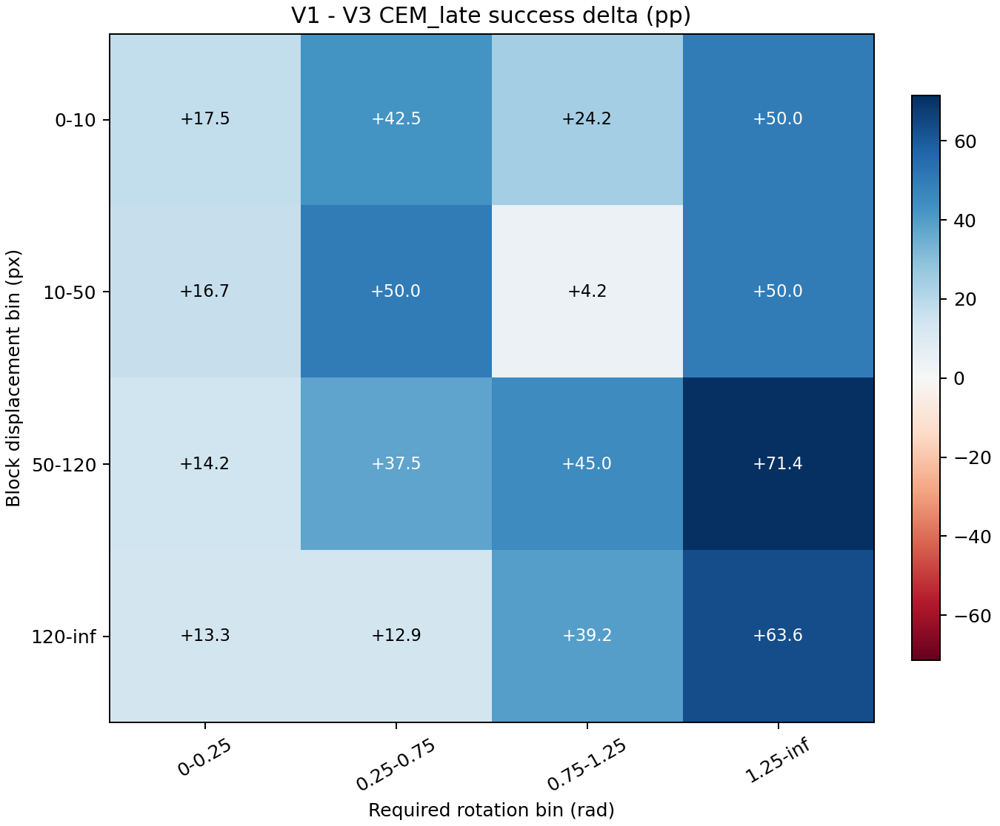
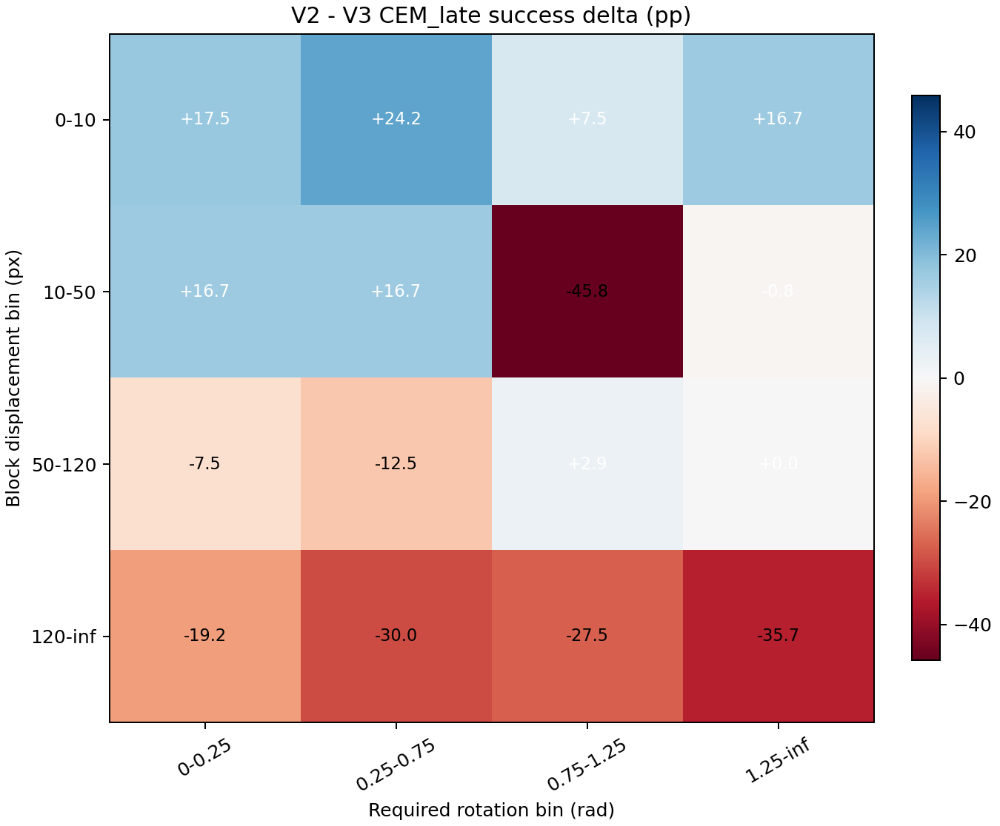
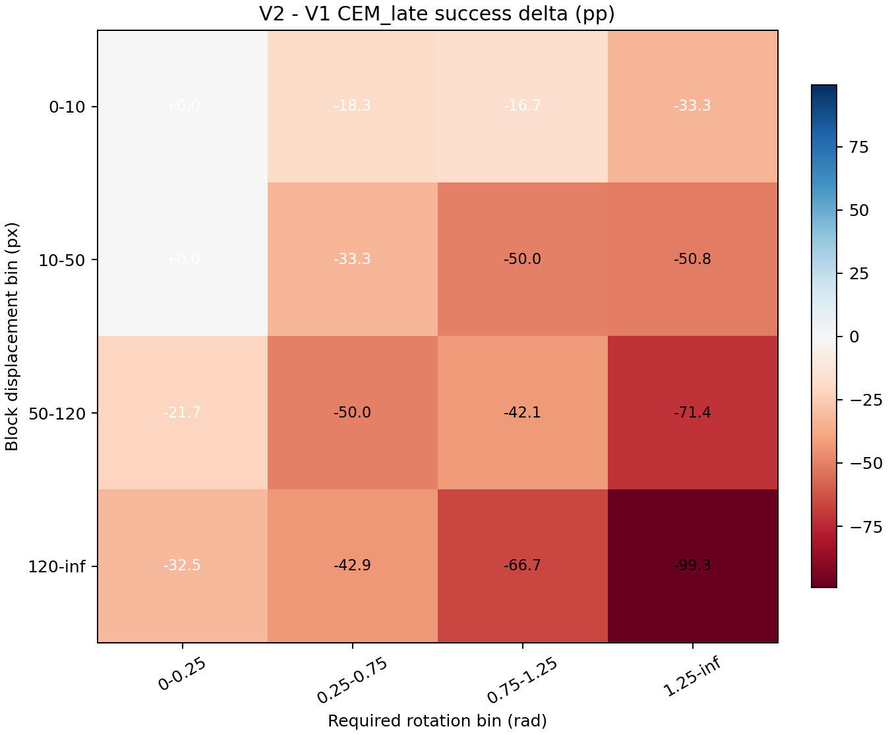
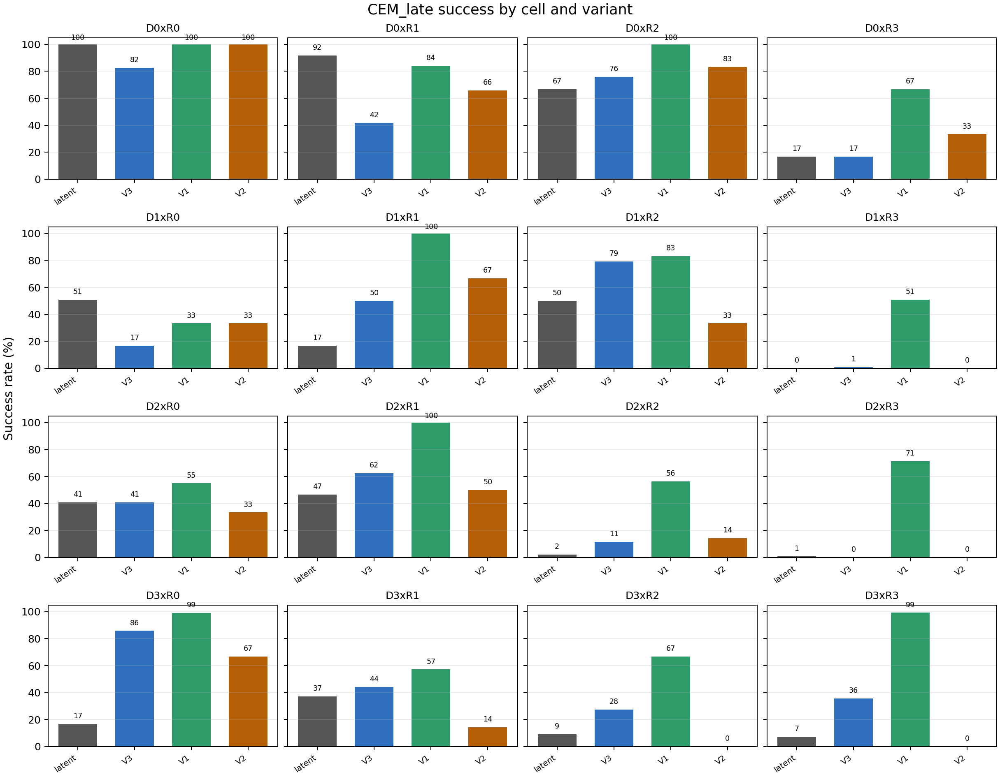

# Oracle Full Variant Comparison

## 1. Provenance

- Report generation git HEAD: `dc5c602ac5ec071c478c8de86b063e50e635463a`
- Latent reference: `results/phase1/track_a_three_cost.json`
- D0 V3 data: `results/phase1/d0_oracle_ablation/d0_oracle_V3.json`
- D1 V3 data: `results/phase1/d1_oracle_ablation/d1_oracle_V3.json`
- D2 V3 data: `results/phase1/d2_oracle_ablation/d2_oracle_V3.json`
- D3 V3 data: `results/phase1/d3_oracle_ablation/d3_oracle_V3.json`
- D0 V1 data: `results/phase1/v1_oracle_ablation/v1_d0.json`
- D1 V1 data: `results/phase1/v1_oracle_ablation/v1_d1.json`
- D2 V1 data: `results/phase1/v1_oracle_ablation/v1_d2.json`
- D3 V1 data: `results/phase1/v1_oracle_ablation/v1_d3.json`
- D0 V2 data: `results/phase1/v2_oracle_ablation/v2_d0.json`
- D1 V2 data: `results/phase1/v2_oracle_ablation/v2_d1.json`
- D2 V2 data: `results/phase1/v2_oracle_ablation/v2_d2.json`
- D3 V2 data: `results/phase1/v2_oracle_ablation/v2_d3.json`
- Latent reference metadata git commit: `45d65afc15466686ed8d63c6427ef9e68ff1a497`
- D0 V3 metadata git commit: `78900c3b439a0f0d5d98f36b2f9aab4449e5cb61`
- D1 V3 metadata git commit: `f9aad7bc7aa45a3b7d2af1282657838b305824a4`
- D2 V3 metadata git commit: `1049a688e1fe7a5535aab78ff1e1d310b40db9f3`
- D3 V3 metadata git commit: `399317f828d8d4f13a0c4d833f0ac15750a74bef`
- D0 V1 metadata git commit: `60fc80034e3b064920f985a3d53b1cbf2b12238a`
- D1 V1 metadata git commit: `60fc80034e3b064920f985a3d53b1cbf2b12238a`
- D2 V1 metadata git commit: `60fc80034e3b064920f985a3d53b1cbf2b12238a`
- D3 V1 metadata git commit: `60fc80034e3b064920f985a3d53b1cbf2b12238a`
- D0 V2 metadata git commit: `7b2b6f6d9f9e725a0c15b1e7f32d1605200620cc`
- D1 V2 metadata git commit: `7b2b6f6d9f9e725a0c15b1e7f32d1605200620cc`
- D2 V2 metadata git commit: `7b2b6f6d9f9e725a0c15b1e7f32d1605200620cc`
- D3 V2 metadata git commit: `7b2b6f6d9f9e725a0c15b1e7f32d1605200620cc`
- Seed: `0` for latent, V3, V1, and V2 artifacts.
- V1/V2 data and smooth_random records were not recomputed; V1/V2 JSONs store only `CEM_early` and `CEM_late` records, with baselines sourced from the matching V3 row JSON.
- Execution pattern: one invocation per row x variant with `scripts/phase1/eval_oracle_cem_only_variant.py`; V1 rows D0-D3 were run first, then V2 rows D0-D3, each with `--cell-filter`, `--variant`, `--output-path`, `--data-smooth-random-source`, and `--resume`.
- D0 V1 wall-clock: `861.40` seconds; D0 V2 wall-clock: `754.00` seconds.
- D1 V1 wall-clock: `843.79` seconds; D1 V2 wall-clock: `744.87` seconds.
- D2 V1 wall-clock: `908.34` seconds; D2 V2 wall-clock: `824.29` seconds.
- D3 V1 wall-clock: `874.03` seconds; D3 V2 wall-clock: `867.18` seconds.
- V1 total wall-clock: `3487.56` seconds.
- V2 total wall-clock: `3190.34` seconds.

## 2. Headline 4x4 Grids

### Grid A. latent vs V3

| D row \ R bin | R0 | R1 | R2 | R3 |
|---|---:|---:|---:|---:|
| D0 | latent+ (-17.50 pp) | latent++ (-50.00 pp) | oracle+ (+9.17 pp) | tie (+0.00 pp) |
| D1 | latent++ (-34.17 pp) | oracle++ (+33.33 pp) | oracle++ (+29.17 pp) | tie (+0.83 pp) |
| D2 | tie (+0.00 pp) | oracle+ (+15.83 pp) | oracle+ (+9.29 pp) | tie (-0.71 pp) |
| D3 | oracle++ (+69.17 pp) | oracle+ (+7.14 pp) | oracle+ (+18.33 pp) | oracle++ (+28.57 pp) |

### Grid B. V3 vs V1

| D row \ R bin | R0 | R1 | R2 | R3 |
|---|---:|---:|---:|---:|
| D0 | V1+ (+17.50 pp) | V1++ (+42.50 pp) | V1++ (+24.17 pp) | V1++ (+50.00 pp) |
| D1 | V1+ (+16.67 pp) | V1++ (+50.00 pp) | tie (+4.17 pp) | V1++ (+50.00 pp) |
| D2 | V1+ (+14.17 pp) | V1++ (+37.50 pp) | V1++ (+45.00 pp) | V1++ (+71.43 pp) |
| D3 | V1+ (+13.33 pp) | V1+ (+12.86 pp) | V1++ (+39.17 pp) | V1++ (+63.57 pp) |

### Grid C. V3 vs V2

| D row \ R bin | R0 | R1 | R2 | R3 |
|---|---:|---:|---:|---:|
| D0 | V2+ (+17.50 pp) | V2++ (+24.17 pp) | V2+ (+7.50 pp) | V2+ (+16.67 pp) |
| D1 | V2+ (+16.67 pp) | V2+ (+16.67 pp) | V3++ (-45.83 pp) | tie (-0.83 pp) |
| D2 | V3+ (-7.50 pp) | V3+ (-12.50 pp) | tie (+2.86 pp) | tie (+0.00 pp) |
| D3 | V3+ (-19.17 pp) | V3++ (-30.00 pp) | V3++ (-27.50 pp) | V3++ (-35.71 pp) |

### Grid D. V1 vs V2

| D row \ R bin | R0 | R1 | R2 | R3 |
|---|---:|---:|---:|---:|
| D0 | tie (+0.00 pp) | V1+ (-18.33 pp) | V1+ (-16.67 pp) | V1++ (-33.33 pp) |
| D1 | tie (+0.00 pp) | V1++ (-33.33 pp) | V1++ (-50.00 pp) | V1++ (-50.83 pp) |
| D2 | V1++ (-21.67 pp) | V1++ (-50.00 pp) | V1++ (-42.14 pp) | V1++ (-71.43 pp) |
| D3 | V1++ (-32.50 pp) | V1++ (-42.86 pp) | V1++ (-66.67 pp) | V1++ (-99.29 pp) |

## 3. Full 16-Cell Variant Matrix

| cell | latent_CEM_late | V3_CEM_late | V1_CEM_late | V2_CEM_late | delta_V3_vs_latent_pp | delta_V1_vs_V3_pp | delta_V2_vs_V1_pp |
|---|---:|---:|---:|---:|---:|---:|---:|
| D0xR0 | 100.0% | 82.5% | 100.0% | 100.0% | -17.50 | 17.50 | 0.00 |
| D0xR1 | 91.7% | 41.7% | 84.2% | 65.8% | -50.00 | 42.50 | -18.33 |
| D0xR2 | 66.7% | 75.8% | 100.0% | 83.3% | 9.17 | 24.17 | -16.67 |
| D0xR3 | 16.7% | 16.7% | 66.7% | 33.3% | 0.00 | 50.00 | -33.33 |
| D1xR0 | 50.8% | 16.7% | 33.3% | 33.3% | -34.17 | 16.67 | 0.00 |
| D1xR1 | 16.7% | 50.0% | 100.0% | 66.7% | 33.33 | 50.00 | -33.33 |
| D1xR2 | 50.0% | 79.2% | 83.3% | 33.3% | 29.17 | 4.17 | -50.00 |
| D1xR3 | 0.0% | 0.8% | 50.8% | 0.0% | 0.83 | 50.00 | -50.83 |
| D2xR0 | 40.8% | 40.8% | 55.0% | 33.3% | 0.00 | 14.17 | -21.67 |
| D2xR1 | 46.7% | 62.5% | 100.0% | 50.0% | 15.83 | 37.50 | -50.00 |
| D2xR2 | 2.1% | 11.4% | 56.4% | 14.3% | 9.29 | 45.00 | -42.14 |
| D2xR3 | 0.7% | 0.0% | 71.4% | 0.0% | -0.71 | 71.43 | -71.43 |
| D3xR0 | 16.7% | 85.8% | 99.2% | 66.7% | 69.17 | 13.33 | -32.50 |
| D3xR1 | 37.1% | 44.3% | 57.1% | 14.3% | 7.14 | 12.86 | -42.86 |
| D3xR2 | 9.2% | 27.5% | 66.7% | 0.0% | 18.33 | 39.17 | -66.67 |
| D3xR3 | 7.1% | 35.7% | 99.3% | 0.0% | 28.57 | 63.57 | -99.29 |

## 4. Critical Cell Groups

### Group 1. Oracle-Favorable Cells

Question: does V1 or V2 add further gain over V3?

| cell | V3 | V1 | V2 | V1-V3 pp | V2-V3 pp | V2-V1 pp |
|---|---:|---:|---:|---:|---:|---:|
| D3xR0 | 85.8% | 99.2% | 66.7% | 13.33 | -19.17 | -32.50 |
| D3xR1 | 44.3% | 57.1% | 14.3% | 12.86 | -30.00 | -42.86 |
| D3xR2 | 27.5% | 66.7% | 0.0% | 39.17 | -27.50 | -66.67 |
| D3xR3 | 35.7% | 99.3% | 0.0% | 63.57 | -35.71 | -99.29 |
| D1xR1 | 50.0% | 100.0% | 66.7% | 50.00 | 16.67 | -33.33 |
| D1xR2 | 79.2% | 83.3% | 33.3% | 4.17 | -45.83 | -50.00 |
| D2xR1 | 62.5% | 100.0% | 50.0% | 37.50 | -12.50 | -50.00 |
| D2xR2 | 11.4% | 56.4% | 14.3% | 45.00 | 2.86 | -42.14 |
| D0xR2 | 75.8% | 100.0% | 83.3% | 24.17 | 7.50 | -16.67 |

### Group 2. Latent-Favorable Cells

Question: does V1 or V2 close the gap to latent or beat it?

| cell | latent | V3 | V1 | V2 | V1-V3 pp | V2-V3 pp | V1-latent pp | V2-latent pp |
|---|---:|---:|---:|---:|---:|---:|---:|---:|
| D0xR0 | 100.0% | 82.5% | 100.0% | 100.0% | 17.50 | 17.50 | 0.00 | 0.00 |
| D0xR1 | 91.7% | 41.7% | 84.2% | 65.8% | 42.50 | 24.17 | -7.50 | -25.83 |
| D1xR0 | 50.8% | 16.7% | 33.3% | 33.3% | 16.67 | 16.67 | -17.50 | -17.50 |

### Group 3. Tie Cells

Question: does V1 or V2 break the tie either way?

| cell | latent | V3 | V1 | V2 | V1-V3 pp | V2-V3 pp | V2-V1 pp |
|---|---:|---:|---:|---:|---:|---:|---:|
| D0xR3 | 16.7% | 16.7% | 66.7% | 33.3% | 50.00 | 16.67 | -33.33 |
| D1xR3 | 0.0% | 0.8% | 50.8% | 0.0% | 50.00 | -0.83 | -50.83 |
| D2xR0 | 40.8% | 40.8% | 55.0% | 33.3% | 14.17 | -7.50 | -21.67 |
| D2xR3 | 0.7% | 0.0% | 71.4% | 0.0% | 71.43 | 0.00 | -71.43 |

## 5. Cost-Shape Sensitivity Check

V1 and V2 differ by >5 pp in 14/16 cells: V1 > V2 in 14, V2 > V1 in 0. Most positive V1 - V2: D3xR3 (+99.29 pp). Most negative V1 - V2: D0xR0 (+0.00 pp).

| cell | V1-V2 pp | direction |
|---|---:|---:|
| D0xR1 | +18.33 | V1 > V2 |
| D0xR2 | +16.67 | V1 > V2 |
| D0xR3 | +33.33 | V1 > V2 |
| D1xR1 | +33.33 | V1 > V2 |
| D1xR2 | +50.00 | V1 > V2 |
| D1xR3 | +50.83 | V1 > V2 |
| D2xR0 | +21.67 | V1 > V2 |
| D2xR1 | +50.00 | V1 > V2 |
| D2xR2 | +42.14 | V1 > V2 |
| D2xR3 | +71.43 | V1 > V2 |
| D3xR0 | +32.50 | V1 > V2 |
| D3xR1 | +42.86 | V1 > V2 |
| D3xR2 | +66.67 | V1 > V2 |
| D3xR3 | +99.29 | V1 > V2 |

## 6. Pattern Summary

- Group 1: V1 exceeded V3 in 9/9 cells (mean delta +32.20 pp); V2 exceeded V3 in 3/9 cells (mean delta -15.97 pp). The best of V1/V2 exceeded V3 in 9/9 cells.
- Group 2: V1/V2 closure versus V3 ranged from +16.67 pp to +42.50 pp; >30 pp closures: V1 D0xR1 (+42.50 pp). Variants beating latent: none.
- Group 3: V1 moved relative to V3 by +14.17 to +71.43 pp; V2 moved relative to V3 by -7.50 to +16.67 pp.
- V1 vs V2: V1 and V2 differ by >5 pp in 14/16 cells: V1 > V2 in 14, V2 > V1 in 0. Most positive V1 - V2: D3xR3 (+99.29 pp). Most negative V1 - V2: D0xR0 (+0.00 pp).
- V1 per-row sanity versus V3:
  - D0: V1 >= V3 in 4/4 cells; V1 < V3 in 0/4 cells: none.
  - D1: V1 >= V3 in 4/4 cells; V1 < V3 in 0/4 cells: none.
  - D2: V1 >= V3 in 4/4 cells; V1 < V3 in 0/4 cells: none.
  - D3: V1 >= V3 in 4/4 cells; V1 < V3 in 0/4 cells: none.
- V2 per-row sanity versus V3:
  - D0: V2 >= V3 in 4/4 cells; V2 < V3 in 0/4 cells: none.
  - D1: V2 >= V3 in 2/4 cells; V2 < V3 in 2/4 cells: D1xR2 (-45.83 pp), D1xR3 (-0.83 pp).
  - D2: V2 >= V3 in 2/4 cells; V2 < V3 in 2/4 cells: D2xR0 (-7.50 pp), D2xR1 (-12.50 pp).
  - D3: V2 >= V3 in 0/4 cells; V2 < V3 in 4/4 cells: D3xR0 (-19.17 pp), D3xR1 (-30.00 pp), D3xR2 (-27.50 pp), D3xR3 (-35.71 pp).

## 7. Limitations

- Ceiling effects remain important: D0 latent success is already high in some cells, so absolute pp gaps can understate relative improvement.
- Oracle CEM uses real-env state; these variants are diagnostic upper-bound planners, not deployable latent planners.
- The V3 scalar cost is not equivalent to PushT's conjunctive success criterion; negative-delta cells should be read against that mismatch.
- Per-cell sample sizes are 6 or 7 pairs, so cell-level rates can move substantially if a small number of pairs change outcome.
- V1 and V2 share the same alpha=20/(pi/9) hinge boundary; a different alpha might yield different results.
- V2 indicator has zero gradient inside the success region; CEM may behave qualitatively differently from gradient-based assumptions.
- All variants share the same 80 actions sampling design; V1/V2 store only the 40 recomputed CEM records and rely on V3 for the 40 shared data/smooth_random records.
- V2 selected-elite cost degeneracy proxy: 60 pairs had all stored early and late V2 elite costs equal to 1.0; the artifacts do not store every candidate cost for all 30 iterations.

## 8. Recommended Next Step

Recommendation, user decides: run per-trajectory visualization on a curated set of telling cells. The full-grid table now identifies where success-aligned oracle costs helped, hurt, or split by cost shape; visualizing a small set from Groups 1, 2, and 3 is the most direct way to inspect whether the numerical changes come from qualitatively different pushes, rotations, or terminal near-misses before Track A consolidation freezes the narrative.

## 9. Heatmap PNGs

