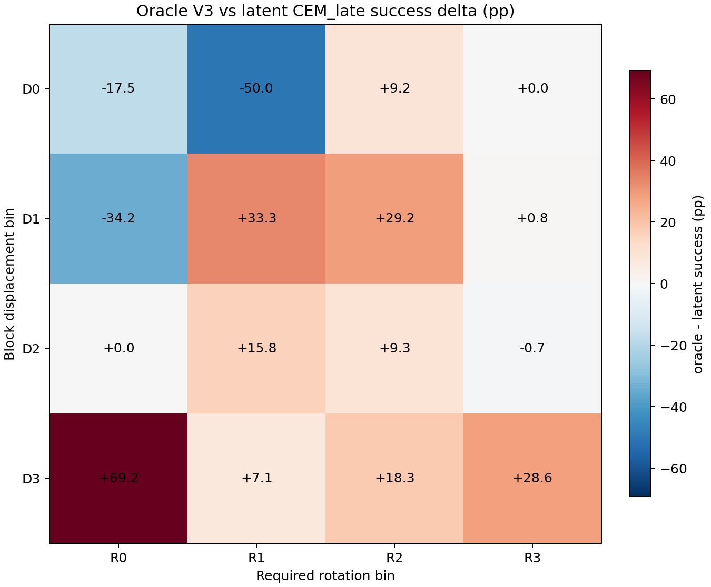
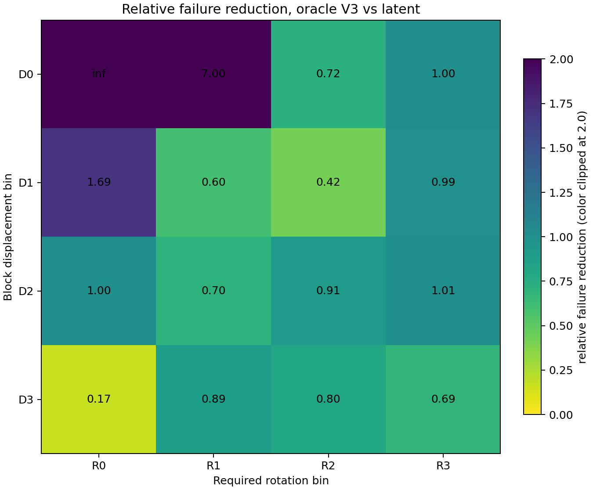

# Oracle V3 Row Comparison (D0-D3)

## 1. Provenance

- Track A reference data: `results/phase1/track_a_three_cost.json`
- D0 oracle V3 data: `results/phase1/d0_oracle_ablation/d0_oracle_V3.json`
- D1 oracle V3 data: `results/phase1/d1_oracle_ablation/d1_oracle_V3.json`
- D2 oracle V3 data: `results/phase1/d2_oracle_ablation/d2_oracle_V3.json`
- D3 oracle V3 data: `results/phase1/d3_oracle_ablation/d3_oracle_V3.json`
- Track A reference git commit in metadata: `45d65afc15466686ed8d63c6427ef9e68ff1a497`
- D0 V3 artifact commit: `9cb64aa2c9812c6a9a0b97ecf1897d8bf4ac301a`
- D1 V3 artifact commit: `1049a688e1fe7a5535aab78ff1e1d310b40db9f3`
- D2 V3 artifact commit: `1a7999d7cf8e4bd99b9877611939f548ddf5c892`
- D3 V3 artifact commit: `78900c3b439a0f0d5d98f36b2f9aab4449e5cb61`
- D0 run wall-clock: `807.94` seconds (`13.47` minutes; output metadata); external `/usr/bin/time`: `816.95` seconds.
- D1 run wall-clock: `855.41` seconds (`14.26` minutes; output metadata); external `/usr/bin/time`: `864.17` seconds.
- D2 run wall-clock: `933.98` seconds (`15.57` minutes; output metadata); external `/usr/bin/time`: `943.36` seconds.
- D3 run wall-clock: `952.62` seconds (`15.88` minutes; output metadata).
- Locked parameters: V3 baseline cost only; oracle real-state planner cost; seed 0; CEM 300/30/30, horizon 5, action_block 5; 80 actions per pair with 20/20/20/20 split.
- Execution path: reused `scripts/phase1/eval_d3_oracle_ablation.py` with row-specific `--cell-filter` and output directories; no oracle-CEM implementation changes were made.

## 2. Per-Row Sanity Tables

### D0

| Cell | Track A latent CEM_late | V3 oracle CEM_late | Delta CEM_late pp | Relative failure reduction CEM_late | Track A latent overall | V3 oracle overall |
|---|---:|---:|---:|---:|---:|---:|
| D0xR0 | 100.0% | 82.5% | -17.50 | inf | 76.7% | 74.2% |
| D0xR1 | 91.7% | 41.7% | -50.00 | 7.000 | 44.6% | 31.7% |
| D0xR2 | 66.7% | 75.8% | 9.17 | 0.725 | 32.1% | 21.9% |
| D0xR3 | 16.7% | 16.7% | 0.00 | 1.000 | 4.6% | 4.4% |
| D0_overall | 68.8% | 54.2% | -14.58 | 1.467 | 39.5% | 33.0% |

### D1

| Cell | Track A latent CEM_late | V3 oracle CEM_late | Delta CEM_late pp | Relative failure reduction CEM_late | Track A latent overall | V3 oracle overall |
|---|---:|---:|---:|---:|---:|---:|
| D1xR0 | 50.8% | 16.7% | -34.17 | 1.695 | 27.1% | 17.7% |
| D1xR1 | 16.7% | 50.0% | 33.33 | 0.600 | 7.5% | 23.3% |
| D1xR2 | 50.0% | 79.2% | 29.17 | 0.417 | 19.0% | 21.9% |
| D1xR3 | 0.0% | 0.8% | 0.83 | 0.992 | 0.0% | 0.2% |
| D1_overall | 29.4% | 36.7% | 7.29 | 0.897 | 13.4% | 15.8% |

### D2

| Cell | Track A latent CEM_late | V3 oracle CEM_late | Delta CEM_late pp | Relative failure reduction CEM_late | Track A latent overall | V3 oracle overall |
|---|---:|---:|---:|---:|---:|---:|
| D2xR0 | 40.8% | 40.8% | 0.00 | 1.000 | 15.0% | 14.6% |
| D2xR1 | 46.7% | 62.5% | 15.83 | 0.703 | 17.3% | 22.5% |
| D2xR2 | 2.1% | 11.4% | 9.29 | 0.905 | 0.9% | 4.5% |
| D2xR3 | 0.7% | 0.0% | -0.71 | 1.007 | 0.2% | 0.2% |
| D2_overall | 21.0% | 26.9% | 5.96 | 0.925 | 7.7% | 9.8% |

### D3

| Cell | Track A latent CEM_late | V3 oracle CEM_late | Delta CEM_late pp | Relative failure reduction CEM_late | Track A latent overall | V3 oracle overall |
|---|---:|---:|---:|---:|---:|---:|
| D3xR0 | 16.7% | 85.8% | 69.17 | 0.170 | 7.9% | 32.9% |
| D3xR1 | 37.1% | 44.3% | 7.14 | 0.886 | 11.4% | 17.5% |
| D3xR2 | 9.2% | 27.5% | 18.33 | 0.798 | 2.7% | 9.0% |
| D3xR3 | 7.1% | 35.7% | 28.57 | 0.692 | 1.8% | 9.6% |
| D3_overall | 17.9% | 47.7% | 29.81 | 0.637 | 6.0% | 17.0% |

## 3. Full 16-Cell Comparison Matrix

| Cell | latent_CEM_late_success | oracle_CEM_late_success | delta_pp | relative_failure_reduction | latent_overall | oracle_overall |
|---|---:|---:|---:|---:|---:|---:|
| D3xR0 | 16.7% | 85.8% | 69.17 | 0.170 | 7.9% | 32.9% |
| D1xR2 | 50.0% | 79.2% | 29.17 | 0.417 | 19.0% | 21.9% |
| D1xR1 | 16.7% | 50.0% | 33.33 | 0.600 | 7.5% | 23.3% |
| D3xR3 | 7.1% | 35.7% | 28.57 | 0.692 | 1.8% | 9.6% |
| D2xR1 | 46.7% | 62.5% | 15.83 | 0.703 | 17.3% | 22.5% |
| D0xR2 | 66.7% | 75.8% | 9.17 | 0.725 | 32.1% | 21.9% |
| D3xR2 | 9.2% | 27.5% | 18.33 | 0.798 | 2.7% | 9.0% |
| D3xR1 | 37.1% | 44.3% | 7.14 | 0.886 | 11.4% | 17.5% |
| D2xR2 | 2.1% | 11.4% | 9.29 | 0.905 | 0.9% | 4.5% |
| D1xR3 | 0.0% | 0.8% | 0.83 | 0.992 | 0.0% | 0.2% |
| D0xR3 | 16.7% | 16.7% | 0.00 | 1.000 | 4.6% | 4.4% |
| D2xR0 | 40.8% | 40.8% | 0.00 | 1.000 | 15.0% | 14.6% |
| D2xR3 | 0.7% | 0.0% | -0.71 | 1.007 | 0.2% | 0.2% |
| D1xR0 | 50.8% | 16.7% | -34.17 | 1.695 | 27.1% | 17.7% |
| D0xR1 | 91.7% | 41.7% | -50.00 | 7.000 | 44.6% | 31.7% |
| D0xR0 | 100.0% | 82.5% | -17.50 | inf | 76.7% | 74.2% |

## 4. Cell-Level Who Wins Grid

| D row \ R bin | R0 | R1 | R2 | R3 |
|---|---:|---:|---:|---:|
| D0 | latent+ (-17.50 pp) | latent++ (-50.00 pp) | oracle+ (+9.17 pp) | tie (+0.00 pp) |
| D1 | latent++ (-34.17 pp) | oracle++ (+33.33 pp) | oracle++ (+29.17 pp) | tie (+0.83 pp) |
| D2 | tie (+0.00 pp) | oracle+ (+15.83 pp) | oracle+ (+9.29 pp) | tie (-0.71 pp) |
| D3 | oracle++ (+69.17 pp) | oracle+ (+7.14 pp) | oracle+ (+18.33 pp) | oracle++ (+28.57 pp) |

## 5. Pattern Summary

- `oracle++` cells: `4` / 16.
- `oracle+` cells: `5` / 16.
- `tie` cells: `4` / 16.
- `latent+` cells: `1` / 16.
- `latent++` cells: `2` / 16.
- Cells with CEM_late delta_pp >= 10: `6` / 16 (D1xR1, D1xR2, D2xR1, D3xR0, D3xR2, D3xR3).
- Cells with relative_failure_reduction <= 0.5: `2` / 16 (D1xR2, D3xR0).
- Oracle-favorable cells: `D0xR2, D1xR1, D1xR2, D2xR1, D2xR2, D3xR0, D3xR1, D3xR2, D3xR3`. They include the entire D3 row and several R1/R2 cells in D1/D2.
- Latent-favorable cells: `D0xR0, D0xR1, D1xR0`. They are concentrated in low-rotation cells: D0xR0, D0xR1, and D1xR0.
- Strongest oracle advantage: `D3xR0` at `69.17` pp.
- Strongest latent advantage: `D0xR1` at `-50.00` pp.
- D0 mean CEM_late delta: `-14.58` pp.
- D1 mean CEM_late delta: `7.29` pp.
- D2 mean CEM_late delta: `6.10` pp.
- D3 mean CEM_late delta: `30.80` pp.

## 6. Limitations

- Ceiling effects remain important: D0 latent success is already high in some cells, so absolute pp gaps can understate relative improvement and relative failure reduction can become infinite when latent success is 100%.
- Oracle CEM uses real-env state; V3 is an upper bound on what any latent planner can do with this scalar cost.
- The V3 scalar cost is not equivalent to PushT's conjunctive success criterion; negative-delta cells should be read against that already observed mismatch.
- This comparison uses only V3; it does not say whether the success-aligned V1/V2 cost variants would preserve, reduce, or reverse these gaps.
- Per-cell sample sizes are 6 or 7 pairs, so cell-level rates can move substantially if a small number of pairs change outcome.
- The D1 and D2 runs reused the accepted D3 ablation script; the script still prints a legacy V3 sanity-gate failure when a row differs by more than 5pp from Track A, but that gate is not used as a stop condition for this row-comparison pass.

## 7. Recommended Next Step

Recommendation, user decides: run V1/V2 on all 16 cells. The complete V3 matrix is not a D3-only story: oracle-favorable cells include all of D3 plus several D1/D2 rotation bins, while latent-favorable cells appear in D0/D1 low-rotation regimes. A full-grid V1/V2 pass is the cleanest way to test whether success-aligned costs change both sides of that matrix; a D3-only pass would miss the negative-delta cells, and a latent-favorable-only pass would miss whether D3 gains are cost-shape-specific.

## 8. Heatmap PNG

