# Per-Trajectory Visualization Catalog

## 1. Purpose

This catalog indexes per-trajectory visualizations for five locked PushT pairs used to make Track A findings visually concrete. The figures support the Track A F4-F7 findings and the sign-reversal cluster by showing the final selected latent, V3, V1, and V2 trajectories for specific pairs; the statistical evidence remains in the Track A summary and source JSONs.

## 2. Pair Selection

| Anchor finding | pair_id | cell | Selection rule |
|---|---:|---|---|
| F4: D3 row alignment paradox | 80 | D3xR1 | Lowest `pair_id` in D3xR1 |
| F5: predictor sharpness in D3 | 74 | D3xR0 | Lowest `pair_id` in D3xR0 |
| F6: cost-criterion misalignment | 6 | D0xR1 | Lowest `pair_id` in D0xR1 |
| F7: V2 indicator degeneracy | 93 | D3xR3 | Lowest `pair_id` in D3xR3 |
| Sign-reversal cluster | 20 | D0xR3 | Most-negative-rho pair from the Track A analysis report |

## 3. Color And Marker Convention

Variant colors are fixed across all trajectory and cost-panel figures: latent = gray, V3 = blue, V1 = green, and V2 = orange. In block-trajectory overlays, the shared initial block position is a circle, the shared goal block position is a star, and the dashed circle around the goal marks the `block_pos_dist < 20` tolerance. In cost panels, horizontal references mark `block_pos_dist = 20` and `angle_dist = pi/9`; success requires both final metrics to be below their thresholds. In the sign-reversal scatter, marker color denotes action source and star markers denote successful actions when any are present.

## 4. Figure Index

### Pair 80 - D3xR1 - Anchors F4

Pair 80 is the lowest-ID D3xR1 pair. The block-trajectory overlay shows the final selected trajectory for each variant, the cost panel shows per-step block and angle distances, and the cascade panel shows the latent run's source-wise mean costs and success rates for the original 80 sampled actions. Relevant finding: [Track A summary F4](track_a_summary.md#3-headline-findings). Atlas pointer: [D3 row alignment paradox](../../results/failure_atlas/09_d3_row_alignment_paradox.md).

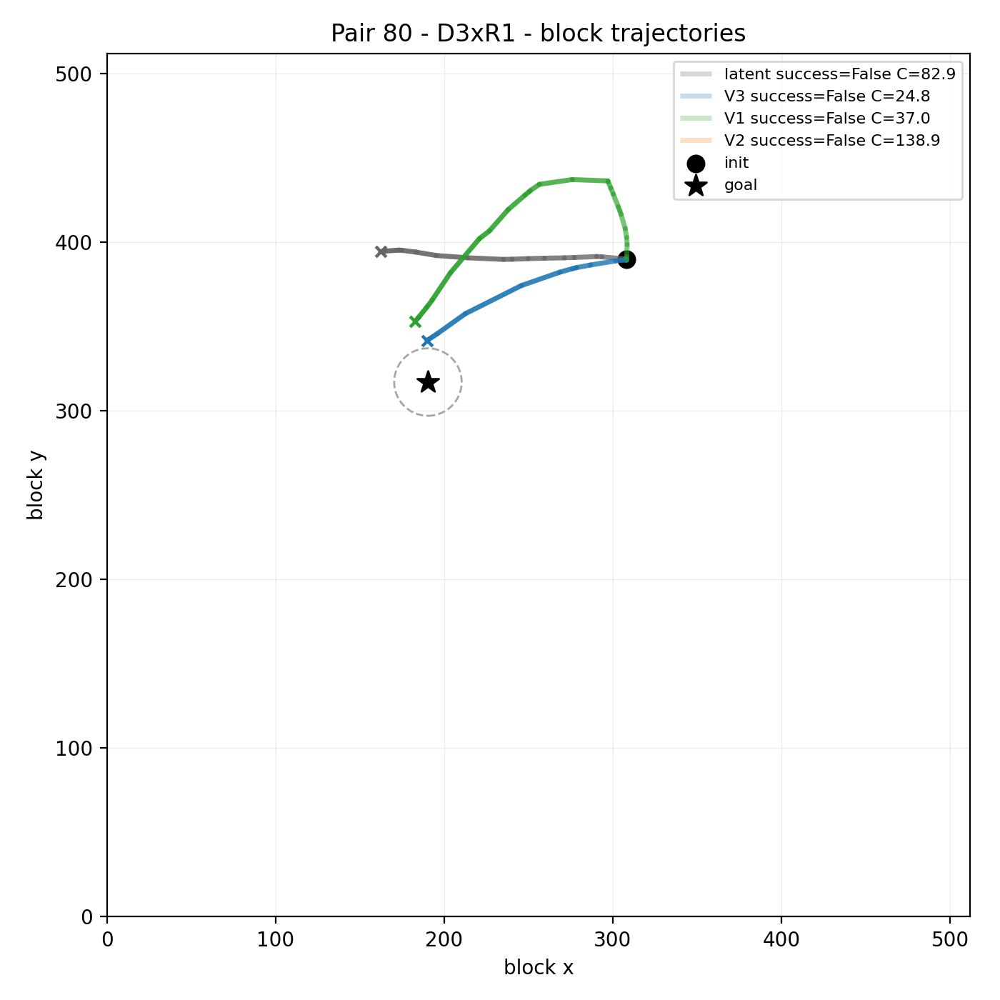

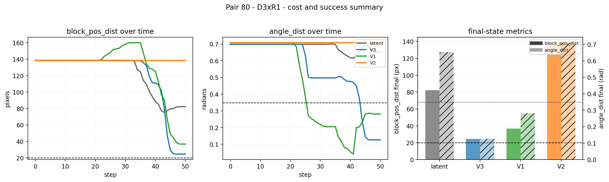

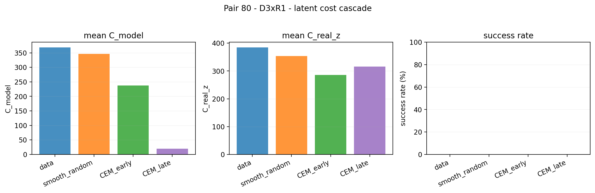

### Pair 74 - D3xR0 - Anchors F5

Pair 74 is the lowest-ID D3xR0 pair. The block-trajectory overlay shows the selected latent and oracle variant paths from the same initial state and goal, the cost panel shows which final thresholds each variant satisfies, and the cascade panel summarizes the original latent-run action sources. Relevant finding: [Track A summary F5](track_a_summary.md#3-headline-findings). Atlas pointer: [predictor-sharpness bottleneck](../../results/failure_atlas/05_predictor_sharpness_bottleneck.md).

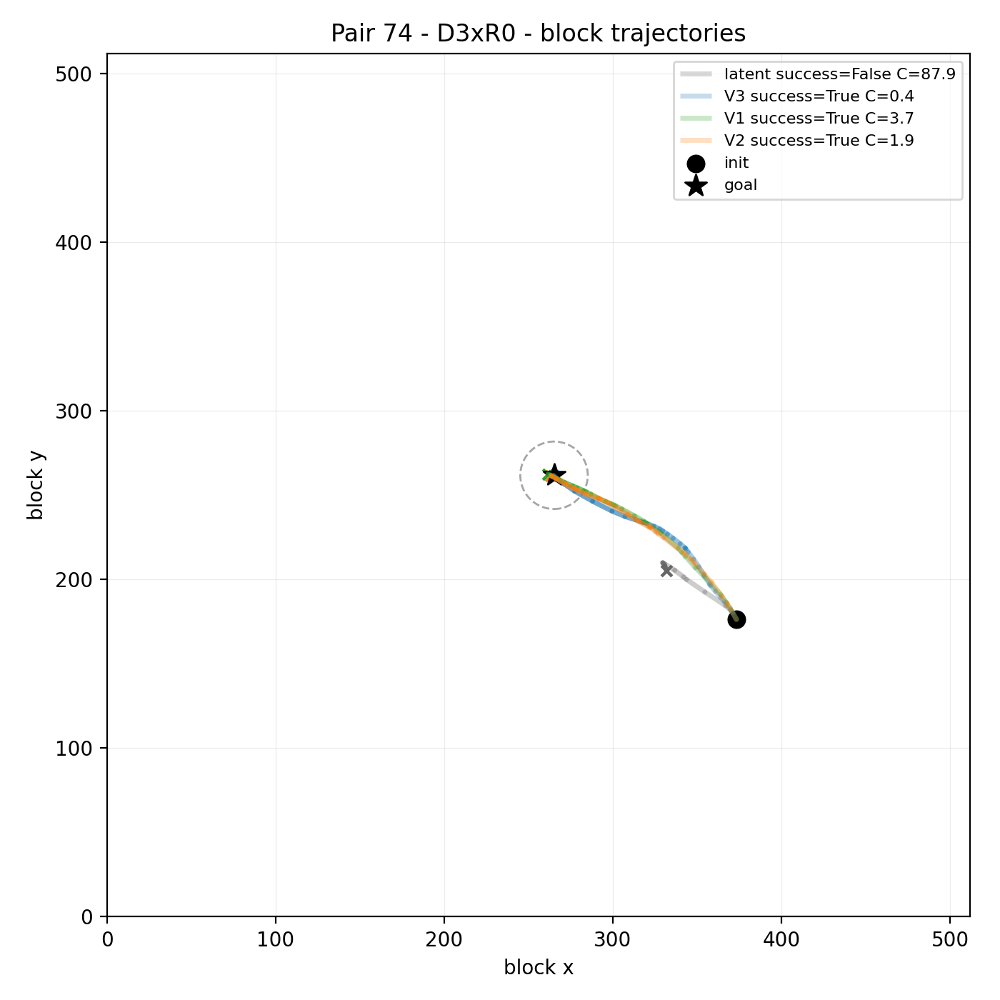

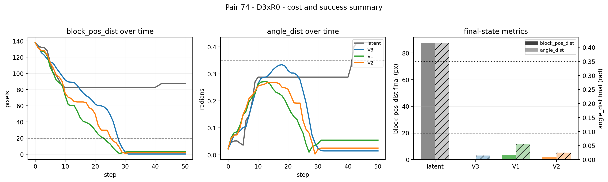

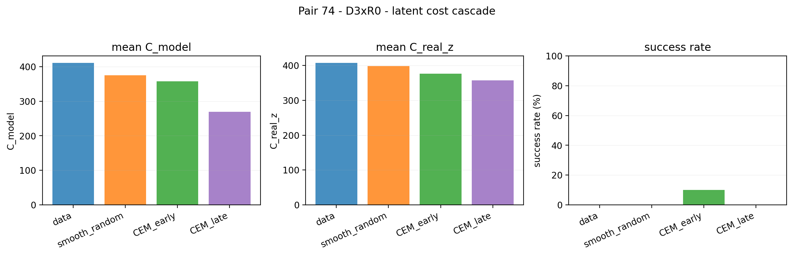

### Pair 6 - D0xR1 - Anchors F6

Pair 6 is the lowest-ID D0xR1 pair. The trajectory and cost-panel figures show the final selected action sequence for latent, V3, V1, and V2 on a low-displacement, low-rotation cell used in the cost-criterion comparison. The cascade panel shows the source-wise latent CEM cost reduction and observed success rates from the original 80 action records. Relevant finding: [Track A summary F6](track_a_summary.md#3-headline-findings). Atlas pointer: [cost-criterion misalignment](../../results/failure_atlas/06_cost_criterion_misalignment.md).

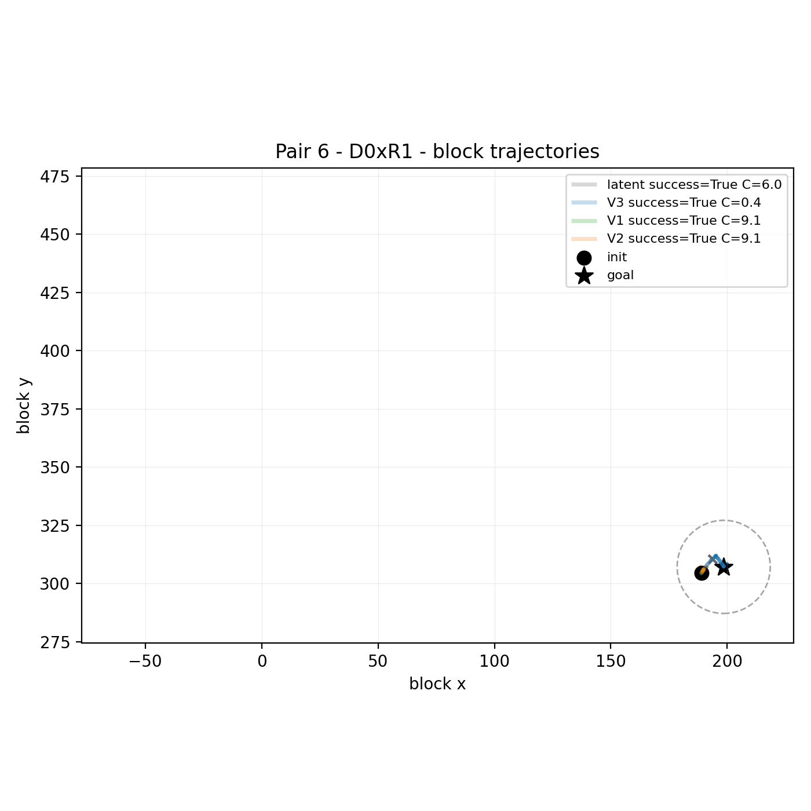

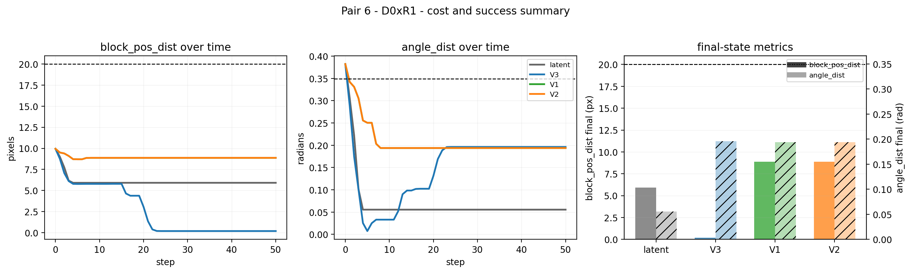

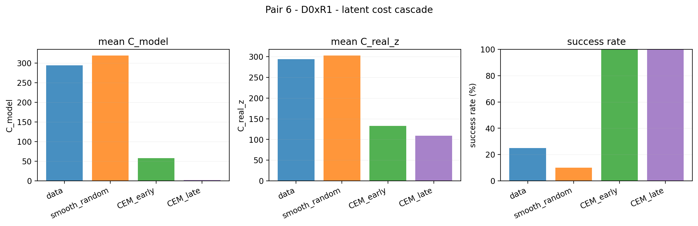

### Pair 93 - D3xR3 - Anchors F7

Pair 93 is the lowest-ID D3xR3 pair. The block-trajectory overlay shows the selected paths for latent, V3, V1, and V2, while the cost panel shows each variant's block and angle distance over the 50 raw steps. The cascade panel summarizes the original latent-run source records for this same pair. Relevant finding: [Track A summary F7](track_a_summary.md#3-headline-findings). Atlas pointer: [indicator cost degeneracy](../../results/failure_atlas/07_indicator_cost_degeneracy.md).

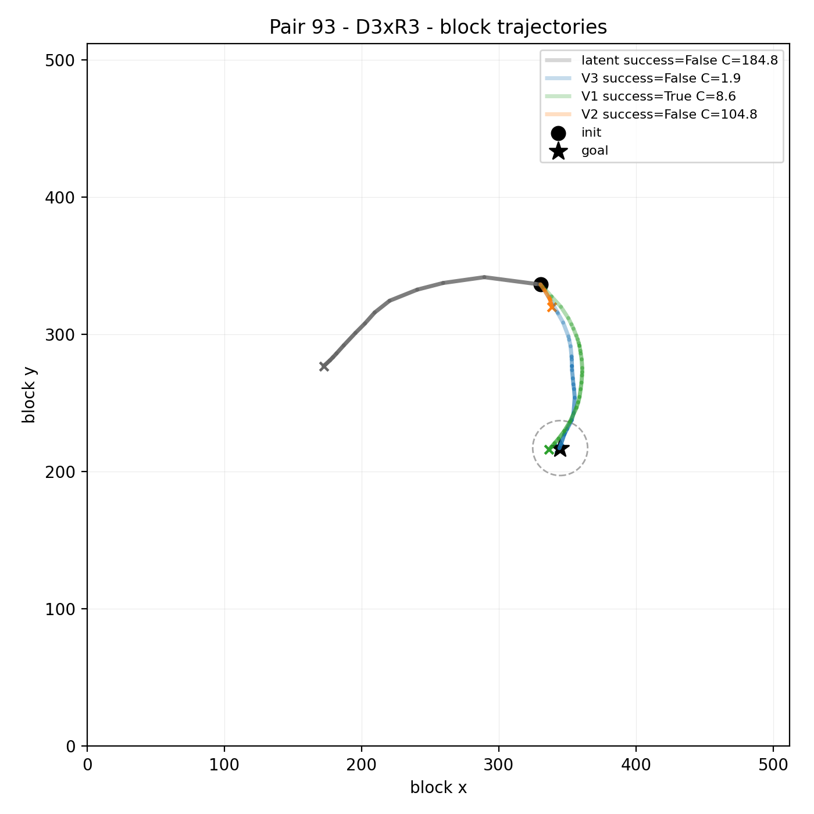

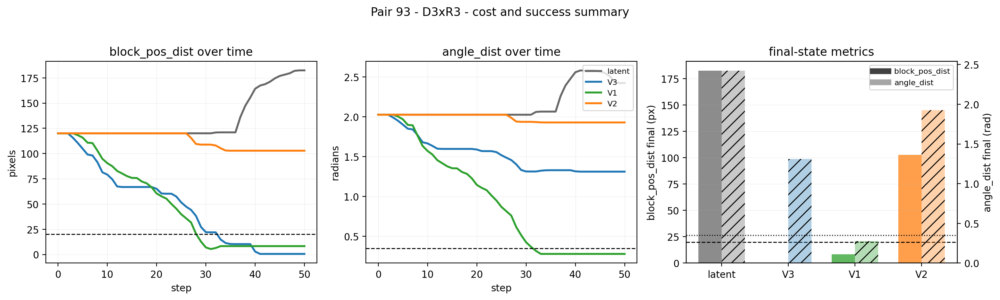

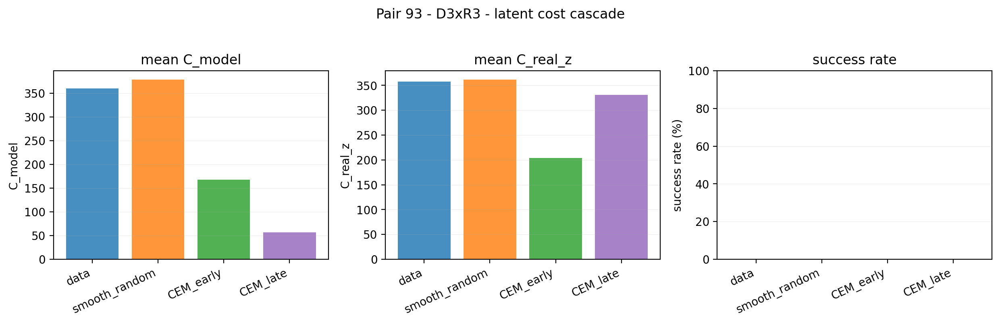

### Pair 20 - D0xR3 - Anchors Sign-Reversal Cluster

Pair 20 is the most-negative-rho pair reported in the Track A sign-reversal analysis. The trajectory and cost-panel figures show the selected latent and oracle variant rollouts, and the scatter plot shows the 80 original Track A action records with `C_real_z` on the x-axis and `C_real_state` on the y-axis. There are no success-star markers in this scatter because all 80 original action records fail the conjunctive success criterion. Relevant finding: [Track A sign-reversal analysis](track_a_analysis_report.md#4-sign-reversal-cluster). Atlas pointer: [rotation-dependent encoding failure, historical Phase 0 page](../../results/failure_atlas/02_rotation_dependent_encoding_failure.md), to be read with [Phase 0 revisions](phase0_revisions.md).

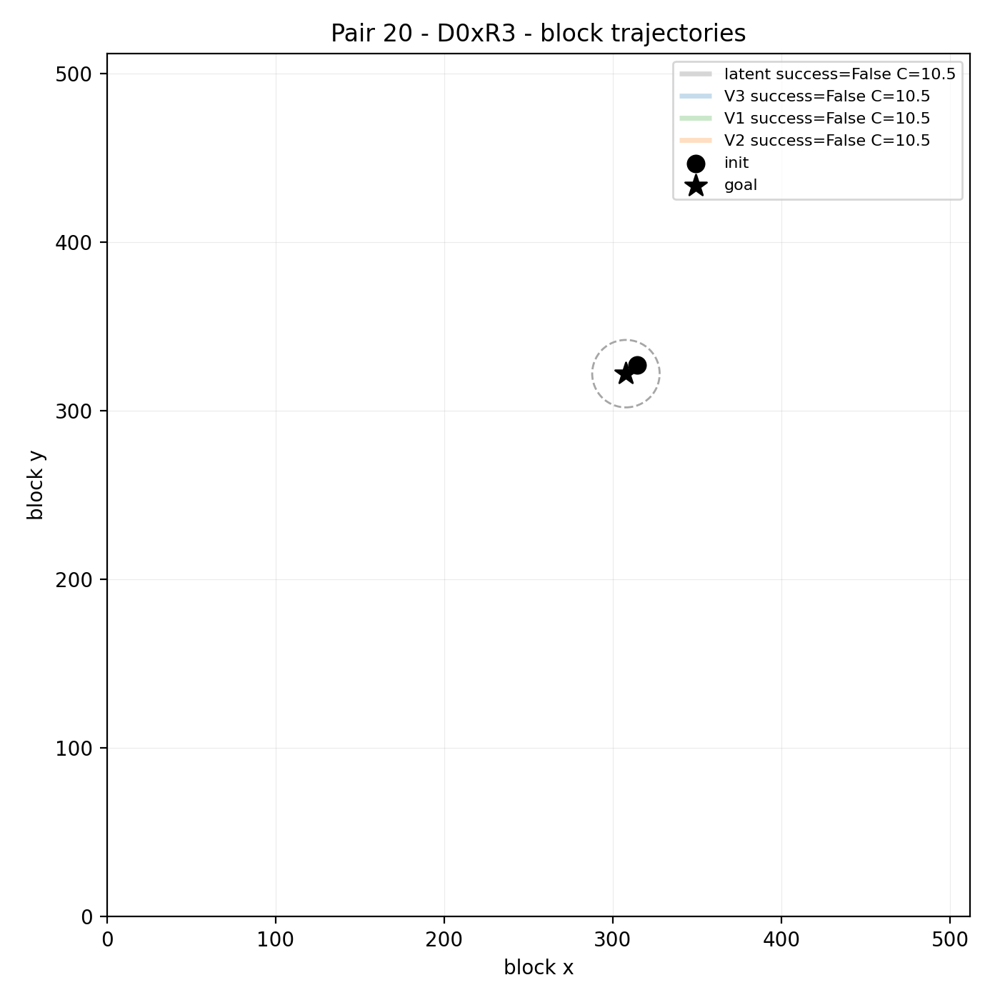

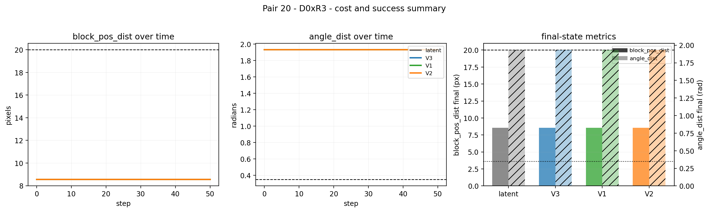

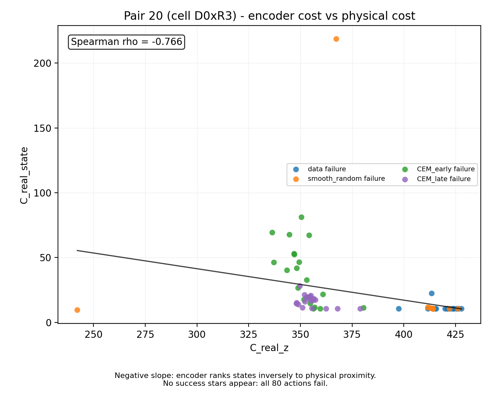

## 5. How To Use This Catalog

Use this catalog as the visual companion to [Track A summary Section 3](track_a_summary.md#3-headline-findings). These figures are illustrative anchors for F4-F7 and the sign-reversal cluster; for statistical evidence, use the Track A summary's headline findings and evidence inventory, and for raw data use the JSON files listed in the summary's Section 2.
