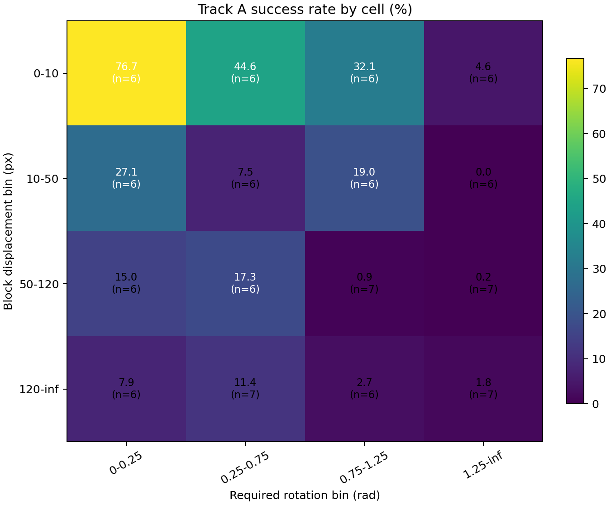
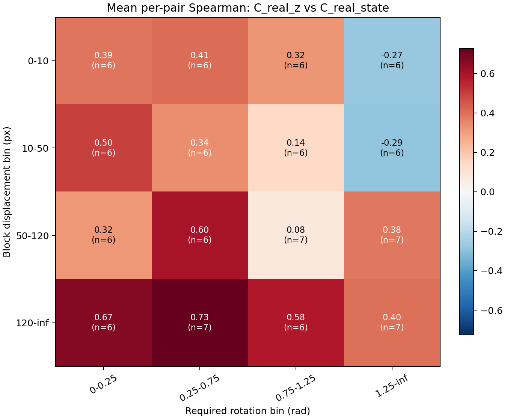
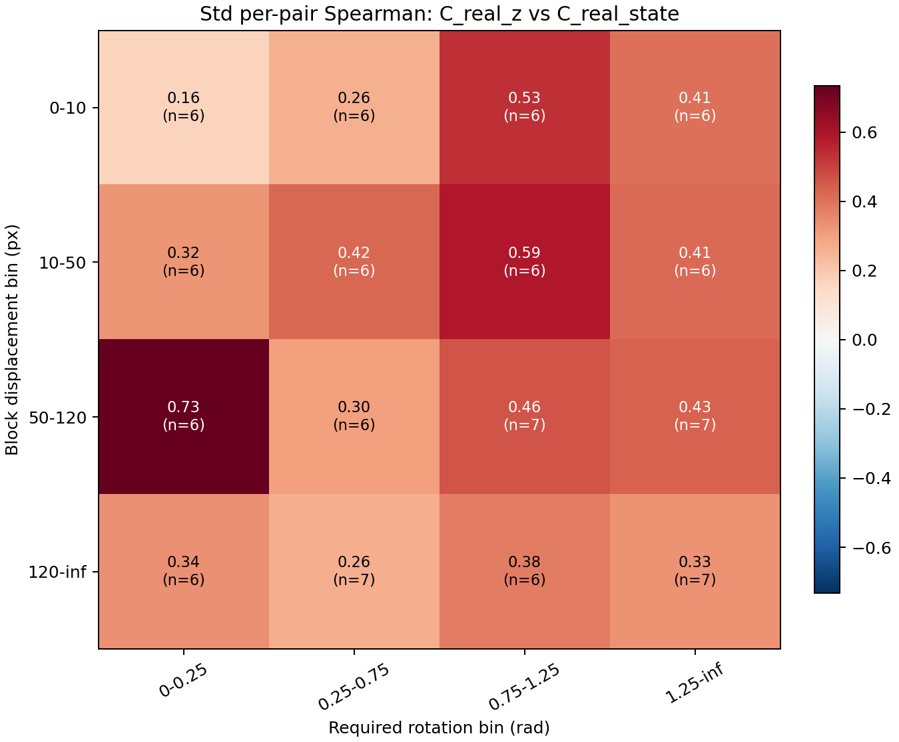
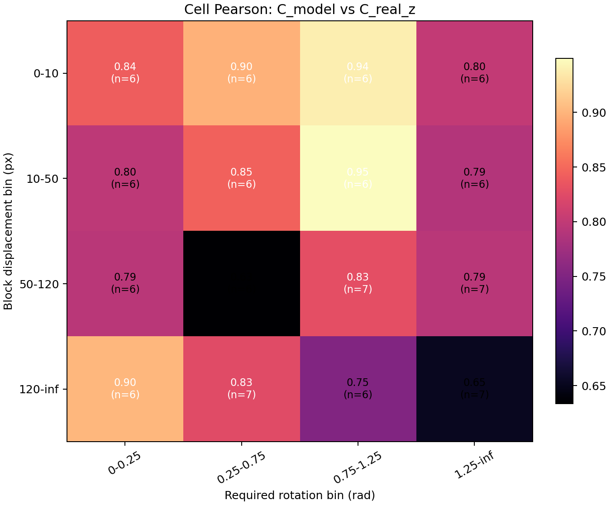
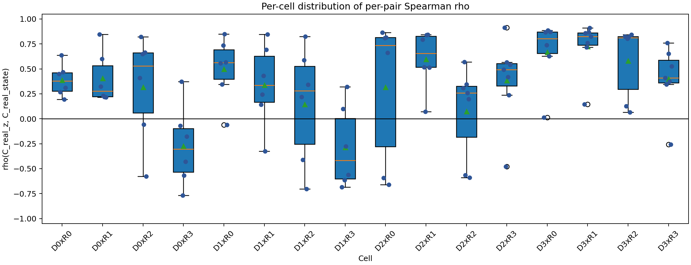
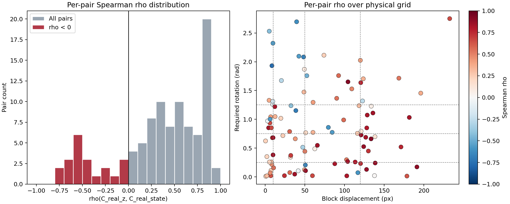

# Track A Analysis Report

## 1. Run Provenance

- Data source: `results/phase1/track_a_three_cost.json`
- Three-cost run git commit: `45d65afc15466686ed8d63c6427ef9e68ff1a497`
- Analysis git commit: `f4893ed636db83241292448113f9bd60b504a7b7`
- Three-cost seed: `0`
- Analysis seed: `0`
- Bootstrap samples: `10000`
- Offset: `50` raw steps
- Pairs/actions: `100` pairs, `80` actions per pair (20/20/20/20)
- CEM: samples `300`, iterations `30`, elites `30`, planning horizon `5`, receding horizon `5`, action block `5`
- Fixed sequence length: `50` raw steps / `10` action blocks
- Machine-readable analysis: `results/phase1/track_a_analysis/track_a_analysis.json`
- Sign-reversal JSON: `results/phase1/track_a_analysis/track_a_sign_reversal_pairs.json`

## 2. DP1 Result

| Field | Value |
|---|---:|
| n_pairs_used | 100 |
| mean_rho | 0.332803 |
| std_rho | 0.477284 |
| median_rho | 0.414375 |
| min_rho | -0.765873 |
| max_rho | 0.914115 |
| ci_low_std | 0.411766 |
| ci_high_std | 0.528787 |
| threshold | 0.300000 |
| verdict | pass |

DP1 passes because the 95% bootstrap CI lower bound on the per-pair Spearman standard deviation is 0.412, versus the threshold 0.300. Phase 0 reference values were mean 0.353 and std 0.486; Track A measured mean 0.333 and std 0.477 across 100 pairs.

## 3. Heatmaps

The success-rate heatmap shows the empirical success fraction within each (displacement, rotation) cell over all mixed-source action sequences. The annotations give the cell value and number of sampled pairs.

The mean per-pair Spearman heatmap summarizes corr(C_real_z, C_real_state) after first computing one correlation per pair. Negative cells are shown with the opposite side of the diverging color scale.

The standard-deviation heatmap shows within-cell spread of the per-pair Spearman values. With 6 or 7 pairs per cell, these standard deviations are small-sample estimates.

The model-vs-real-encoder heatmap computes one Pearson correlation per cell over the cell's mixed-source action records. It describes agreement between predicted and real encoder costs within each cell.

The per-cell distribution plot shows the individual per-pair Spearman values inside each cell. It is included to expose within-cell spread directly.

## 4. Sign-Reversal Cluster

- Pairs with rho < 0: `21`
- Cell breakdown: D0xR2: 2, D0xR3: 5, D1xR0: 1, D1xR1: 1, D1xR2: 2, D1xR3: 4, D2xR0: 2, D2xR2: 2, D2xR3: 1, D3xR3: 1

| Pair | Cell | rho | Success count | Displacement px | Rotation rad |
|---:|---|---:|---:|---:|---:|
| 20 | D0xR3 | -0.766 | 0 | 8.55 | 1.931 |
| 40 | D1xR2 | -0.702 | 0 | 38.71 | 1.152 |
| 42 | D1xR3 | -0.683 | 0 | 48.49 | 2.083 |
| 53 | D2xR0 | -0.660 | 0 | 50.69 | 0.207 |
| 44 | D1xR3 | -0.613 | 0 | 39.69 | 2.694 |
| 49 | D2xR0 | -0.591 | 0 | 116.91 | 0.074 |
| 66 | D2xR2 | -0.591 | 0 | 79.70 | 0.860 |
| 17 | D0xR2 | -0.575 | 5 | 6.23 | 1.003 |
| 21 | D0xR3 | -0.569 | 0 | 9.85 | 2.322 |
| 62 | D2xR2 | -0.563 | 0 | 84.55 | 0.774 |
| 47 | D1xR3 | -0.562 | 0 | 42.53 | 2.096 |
| 69 | D2xR3 | -0.479 | 0 | 52.52 | 1.758 |
| 22 | D0xR3 | -0.429 | 0 | 5.20 | 2.530 |
| 37 | D1xR2 | -0.410 | 0 | 32.59 | 1.237 |
| 33 | D1xR1 | -0.326 | 0 | 47.44 | 0.515 |
| 45 | D1xR3 | -0.274 | 0 | 20.51 | 1.674 |
| 98 | D3xR3 | -0.258 | 0 | 122.80 | 1.319 |
| 23 | D0xR3 | -0.178 | 0 | 9.63 | 1.312 |
| 18 | D0xR3 | -0.071 | 0 | 9.41 | 1.260 |
| 29 | D1xR0 | -0.060 | 2 | 41.71 | 0.106 |
| 15 | D0xR2 | -0.058 | 6 | 3.04 | 0.972 |

The sign-reversal subset is distributed across 10 cells. The largest counts are D0xR3 (5), D1xR3 (4), D0xR2 (2), D1xR2 (2), D2xR0 (2). This paragraph is a distributional description only.

## 5. Limitations / Open Questions

- This does not show whether sign reversal is rotation-specific or angle-discontinuity specific.
- Cell `N_pairs` is 6 or 7, so per-cell standard-deviation estimates are noisy.
- Pearson `C_model` vs `C_real_z` aggregates across 80 mixed-source actions per pair and is not source-stratified.
- This report does not update Phase 0's case classification or the Failure Atlas.
- This report does not test Track B, Track C, or Track D hypotheses.
