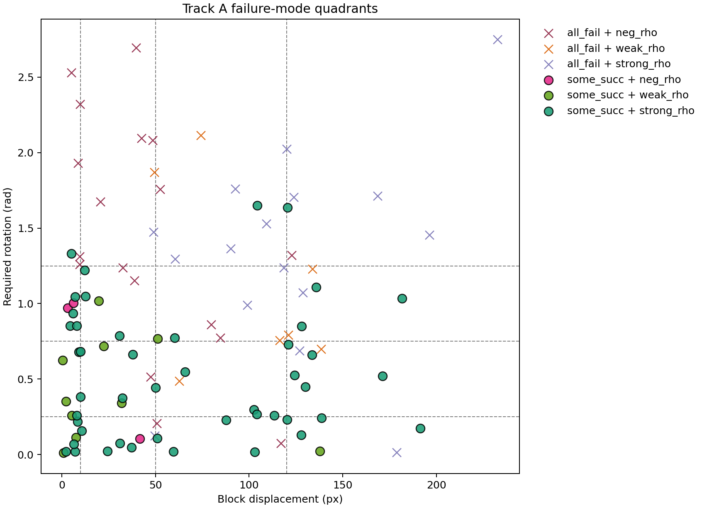
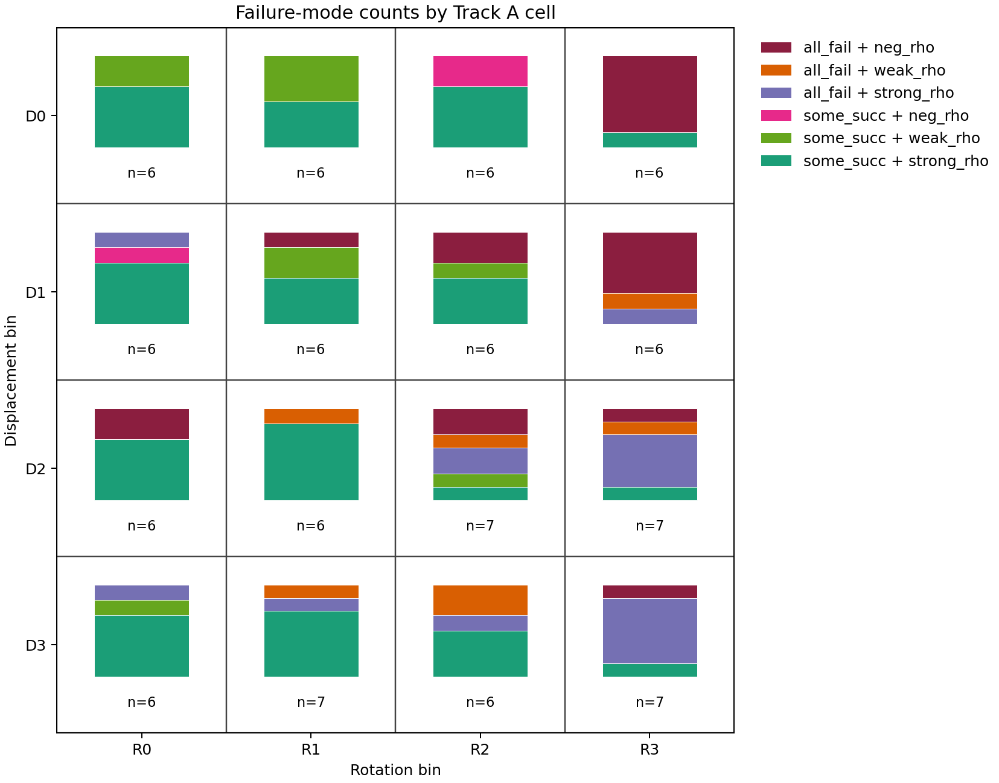
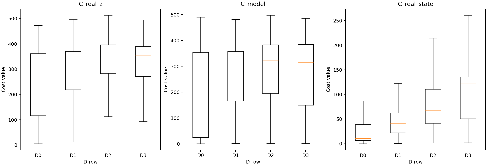
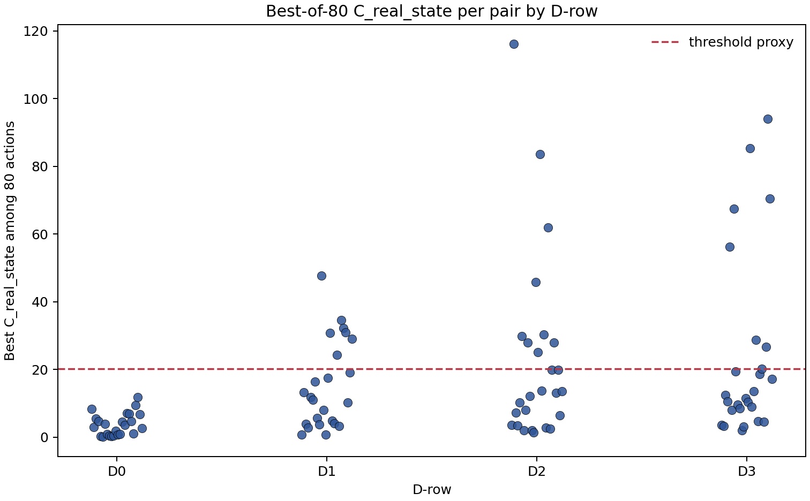
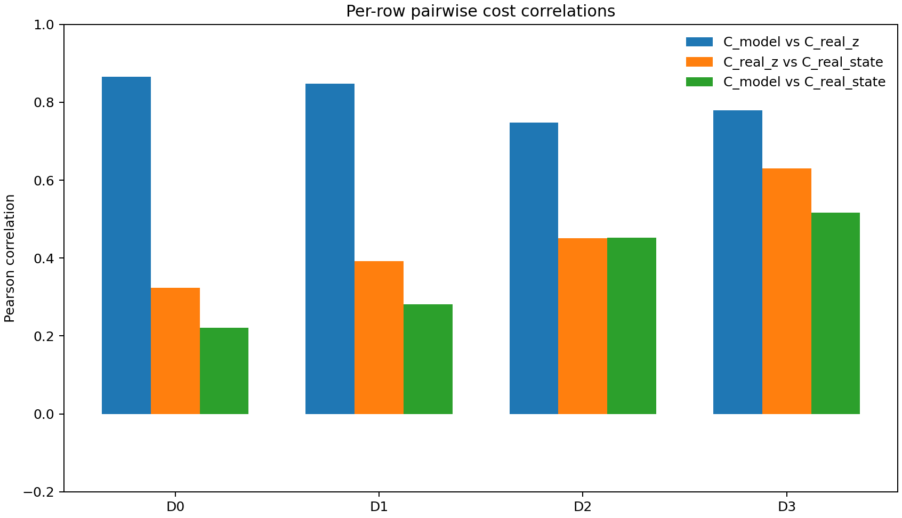

# Track A Supplementary Findings

## 1. Provenance

- Data file: `results/phase1/track_a_three_cost.json`
- Three-cost git commit: `45d65afc15466686ed8d63c6427ef9e68ff1a497`
- Supplementary analysis git commit: `c3adc0e987b3dc1fe42ffd589011c710d21028d0`
- Seed: `0`
- This is a fact sheet for F1/F2 follow-up measurements, not interpretation.
- Failure-mode JSON: `results/phase1/track_a_analysis/failure_mode_decomposition.json`
- D-row cost JSON: `results/phase1/track_a_analysis/d_row_cost_diagnosis.json`

## 2. Failure-Mode Decomposition

| Success class | neg_rho | weak_rho | strong_rho |
|---|---:|---:|---:|
| all_fail | 18 | 7 | 16 |
| some_succ | 3 | 10 | 46 |
| all_succ | 0 | 0 | 0 |

| Quadrant | n_pairs | Pair IDs | Mean displacement px | Mean rotation rad | Cells touched |
|---|---:|---|---:|---:|---|
| all_fail + neg_rho | 18 | 18, 20, 21, 22, 23, 33, 37, 40, 42, 44, 45, 47, 49, 53, 62, 66, 69, 98 | 45.54 | 1.433 | D0xR3, D1xR1, D1xR2, D1xR3, D2xR0, D2xR2, D2xR3, D3xR3 |
| all_fail + weak_rho | 7 | 43, 56, 64, 72, 80, 88, 91 | 99.39 | 1.135 | D1xR3, D2xR1, D2xR2, D2xR3, D3xR1, D3xR2 |
| all_fail + strong_rho | 16 | 25, 46, 60, 61, 67, 70, 71, 73, 78, 86, 87, 93, 94, 96, 97, 99 | 121.51 | 1.325 | D1xR0, D1xR3, D2xR2, D2xR3, D3xR0, D3xR1, D3xR2, D3xR3 |
| some_succ + neg_rho | 3 | 15, 17, 29 | 16.99 | 0.694 | D0xR2, D1xR0 |
| some_succ + weak_rho | 10 | 1, 4, 9, 10, 11, 30, 31, 36, 65, 74 | 27.94 | 0.423 | D0xR0, D0xR1, D1xR1, D1xR2, D2xR2, D3xR0 |
| some_succ + strong_rho | 46 | 0, 2, 3, 5, 6, 7, 8, 12, 13, 14, 16, 19, 24, 26, 27, 28, 32, 34, 35, 38, 39, 41, 48, 50, 51, 52, 54, 55, 57, 58, 59, 63, 68, 75, 76, 77, 79, 81, 82, 83, 84, 85, 89, 90, 92, 95 | 66.26 | 0.536 | D0xR0, D0xR1, D0xR2, D0xR3, D1xR0, D1xR1, D1xR2, D2xR0, D2xR1, D2xR2, D2xR3, D3xR0, D3xR1, D3xR2, D3xR3 |
| all_succ + neg_rho | 0 | - | NA | NA | - |
| all_succ + weak_rho | 0 | - | NA | NA | - |
| all_succ + strong_rho | 0 | - | NA | NA | - |

All-fail per-source verification: `True` across `41` all-fail pairs.

all_fail + neg_rho contains 18 pairs; mean displacement 45.54 px and mean rotation 1.433 rad. Cells touched: D0xR3, D1xR1, D1xR2, D1xR3, D2xR0, D2xR2, D2xR3, D3xR3.
all_fail + weak_rho contains 7 pairs; mean displacement 99.39 px and mean rotation 1.135 rad. Cells touched: D1xR3, D2xR1, D2xR2, D2xR3, D3xR1, D3xR2.
all_fail + strong_rho contains 16 pairs; mean displacement 121.51 px and mean rotation 1.325 rad. Cells touched: D1xR0, D1xR3, D2xR2, D2xR3, D3xR0, D3xR1, D3xR2, D3xR3.
some_succ + neg_rho contains 3 pairs; mean displacement 16.99 px and mean rotation 0.694 rad. Cells touched: D0xR2, D1xR0.
some_succ + weak_rho contains 10 pairs; mean displacement 27.94 px and mean rotation 0.423 rad. Cells touched: D0xR0, D0xR1, D1xR1, D1xR2, D2xR2, D3xR0.
some_succ + strong_rho contains 46 pairs; mean displacement 66.26 px and mean rotation 0.536 rad. Cells touched: D0xR0, D0xR1, D0xR2, D0xR3, D1xR0, D1xR1, D1xR2, D2xR0, D2xR1, D2xR2, D2xR3, D3xR0, D3xR1, D3xR2, D3xR3.

## 3. D3-Row Cost-Magnitude Diagnosis

| Row | Cost | Mean | Std | Median | IQR | Min | Max |
|---|---|---:|---:|---:|---:|---:|---:|
| D0 | C_real_z | 245.520 | 134.297 | 276.811 | 245.253 | 5.417 | 472.942 |
| D0 | C_model | 214.688 | 155.431 | 247.172 | 329.003 | 0.944 | 490.588 |
| D0 | C_real_state | 32.972 | 49.023 | 10.485 | 32.371 | 0.044 | 344.998 |
| D1 | C_real_z | 284.875 | 108.464 | 312.793 | 152.446 | 12.095 | 496.158 |
| D1 | C_model | 246.727 | 136.452 | 278.349 | 192.003 | 2.041 | 481.287 |
| D1 | C_real_state | 52.865 | 47.585 | 41.522 | 40.090 | 0.695 | 313.484 |
| D2 | C_real_z | 321.927 | 100.608 | 348.516 | 113.759 | 9.669 | 513.378 |
| D2 | C_model | 271.584 | 139.718 | 321.426 | 188.870 | 1.624 | 497.839 |
| D2 | C_real_state | 78.853 | 51.362 | 67.020 | 69.314 | 1.419 | 408.098 |
| D3 | C_real_z | 311.396 | 118.503 | 353.267 | 118.178 | 4.180 | 494.968 |
| D3 | C_model | 264.404 | 148.099 | 314.367 | 234.570 | 1.651 | 486.190 |
| D3 | C_real_state | 104.774 | 58.381 | 121.761 | 85.105 | 1.912 | 339.298 |
| global | C_real_z | 291.959 | 119.546 | 330.848 | 158.860 | 4.180 | 513.378 |
| global | C_model | 250.096 | 146.676 | 290.252 | 251.852 | 0.944 | 497.839 |
| global | C_real_state | 68.344 | 58.506 | 51.070 | 94.638 | 0.044 | 408.098 |

| Row | Median best C_real_state | Pairs below threshold proxy | Pearson C_model/C_real_z | Pearson C_real_z/C_real_state | Pearson C_model/C_real_state |
|---|---:|---:|---:|---:|---:|
| D0 | 3.284 | 24 | 0.865 | 0.323 | 0.221 |
| D1 | 11.364 | 17 | 0.848 | 0.393 | 0.282 |
| D2 | 13.360 | 17 | 0.747 | 0.451 | 0.453 |
| D3 | 12.016 | 19 | 0.780 | 0.630 | 0.517 |
| global | 8.719 | 77 | 0.814 | 0.489 | 0.391 |

Inferred scalar C_real_state threshold proxy: `20.212692`. Method: `empirical_max_successful_C_real_state_upper_bound`. The direct PushT criterion is `block_pos_dist < 20.0 and angle_dist < pi/9`; C_real_state is their sum.

The cost-magnitude figure shows the distribution of each stored cost over all action records in D0-D3. Each subplot uses the same D-row grouping.

The best-cost figure shows the minimum C_real_state among 80 actions for each pair, split by D-row. The dashed line is the scalar threshold proxy described above.

The row-correlation figure shows the three pairwise Pearson correlations among C_real_z, C_model, and C_real_state for each D-row.

## 4. Limitations

- This report does not select a winning hypothesis among H_B1/B2/B3.
- all_fail vs some_succ is binary at success_count=0; a pair with success_count=1 is treated very differently from one with 0, even though they may be physically similar.
- encoder_class thresholds (0, 0.3) are inherited from DP1 and Phase 0; sensitivity to these thresholds is not tested here.
- The scalar C_real_state threshold proxy is not equivalent to the conjunctive PushT success criterion.
- This report does not update Phase 0 case classification, Failure Atlas pages, or Track B/C/D experiments.
