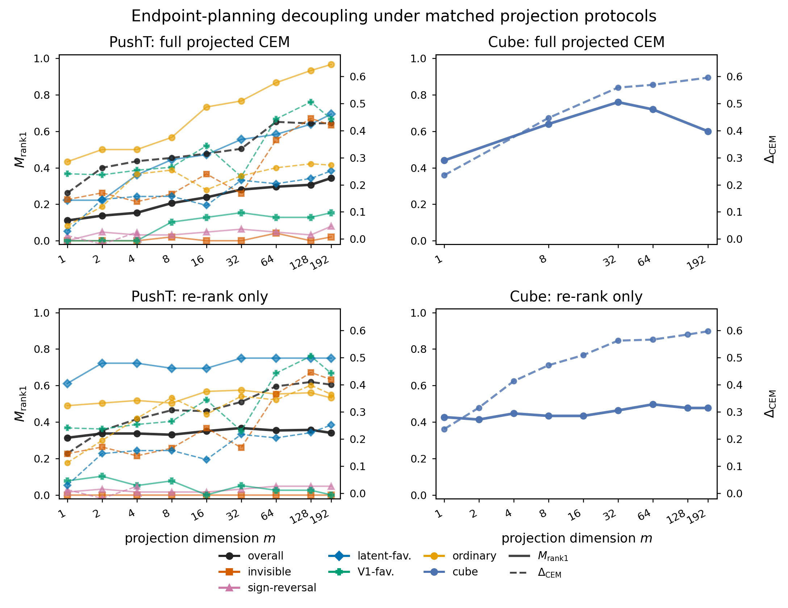

# Phase 2 Blocks 1-4 Progress Record

Generated as an internal progress record for the `phase1` branch. This document summarizes the completed execution-plan Blocks 1 through 4 using the recorded JSON artifacts and memos in the repository.

## Executive Summary

Blocks 1 through 4 completed the protocol-matching, sanity-check, taxonomy, hero-figure, and decision stages of the Phase 2 execution plan. The missing cells in the 2x2 protocol grid were filled: PushT re-rank-only and Cube full projected CEM. The resulting evidence showed that re-rank-only protocols are flat while full projected CEM produces a dimension-dependent elbow in both environments. The CEM Compatibility Gap remained large across environments and protocols because endpoint Spearman increased with projection dimension while CEM-local final-pool Spearman stayed near zero. The binding Block 4 verdict is **Decision Matrix Row 1**: proceed with **Block 5a Subspace-CEM smoke** while starting **Block 5b paper writing** in parallel.

## Timeline

Timestamps are artifact-generation times from the files listed below. ISO timestamps are UTC unless an explicit local offset is shown. Wall-clock runtimes are included only when instrumented in the artifact metadata.

| Block | Deliverable | Completed | Wall-clock | Compute and rollout use |
| --- | --- | --- | ---: | --- |
| Pre-Block 1 baseline record | `docs/phase2/progress_summary.md` | 2026-05-03T03:38:26-0400 | n/a | Summarized prior Phase 2 work through Cube Stage 1B re-rank. |
| Block 1.1 | `results/phase2/protocol_match/pusht_rerank_only.json` | 2026-05-03T16:13:45Z | 5m 16.1s | MPS device; 100 pairs; 9 dims; 3 projection seeds; 2,700 projected records; 30,000 simulator-scored default final-pool candidates; no projected rank-1 extra rollouts. |
| Block 2.1 | `docs/phase2/orthogonal_sanity_check.md` | 2026-05-03T17:29:06Z | not separately instrumented | Offline tensor check only; no simulator, GPU, checkpoint, or policy load. |
| Block 2.2 | `results/phase2/protocol_match/cem_gap_table.json` | 2026-05-03T17:29:38Z | not separately instrumented | Offline JSON aggregation; 27 overall records and 90 PushT subset records. |
| Block 1.2 | `results/phase2/protocol_match/cube_full_proj_cem.json` | 2026-05-03T17:55:57Z | 5m 16.1s | CUDA device; 25 pairs; 5 dims; 1 projection seed; 125 projected records; 125 new simulator rollouts; reused 7,500 default pool scores from Cube Stage 1B. |
| Block 3.1 | `results/phase2/protocol_match/taxonomy_table.json` | 2026-05-03T18:12:12Z | not separately instrumented | Offline taxonomy build; 122 classified rows after adding Cube full projected CEM rows. |
| Block 3.2 | `results/phase2/figures/hero_figure.png` | 2026-05-03T14:13:05-0400 | not separately instrumented | Offline matplotlib rendering; PNG and PDF figure outputs. |
| Block 3.3 / Block 4 | `docs/phase2/protocol_matching_memo.md` | 2026-05-03T18:12:19Z | not separately instrumented | Offline memo generation and binding decision application. |

## Block 1: Protocol Matching

Block 1 closed the cross-environment protocol mismatch identified in `execution_plan.md`. Before this block, PushT had full projected CEM and Cube had re-rank-only. Block 1 produced the missing PushT re-rank-only and Cube full projected CEM cells.

### Block 1.1: PushT Re-Rank-Only

Procedure: the script `scripts/phase2/protocol_match/pusht_rerank_only.py` generated or reused default LeWM CEM final pools, simulator-scored 300 candidates per pair, and then re-ranked those saved pools offline under Gaussian projected costs. The run used 100 PushT pairs, projection dimensions `{1,2,4,8,16,32,64,128,192}`, and projection seeds `{0,1,2}`. Re-ranking did not rerun CEM for each dimension.

| m | Records | Rank-1 success | Pool Spearman | Pool success mass | False elite | Action L2 to default |
| ---: | ---: | ---: | ---: | ---: | ---: | ---: |
| 1 | 300 | 31.3% | 0.050 | 33.1% | 0.879 | 2.40 |
| 2 | 300 | 33.7% | 0.005 | 33.1% | 0.888 | 2.35 |
| 4 | 300 | 33.7% | 0.049 | 33.1% | 0.898 | 2.39 |
| 8 | 300 | 33.0% | 0.073 | 33.1% | 0.907 | 2.18 |
| 16 | 300 | 35.0% | 0.105 | 33.1% | 0.906 | 2.07 |
| 32 | 300 | 36.7% | 0.107 | 33.1% | 0.919 | 1.80 |
| 64 | 300 | 35.3% | 0.079 | 33.1% | 0.933 | 1.59 |
| 128 | 300 | 35.7% | 0.067 | 33.1% | 0.941 | 1.27 |
| 192 | 300 | 34.0% | 0.095 | 33.1% | 0.943 | 1.22 |

Interpretation: PushT re-rank-only is flat by the locked execution-plan rule. Rank-1 success was 33.0% at `m=8`, 36.7% at `m=32`, and 34.0% at `m=192`; the differences from `m=192` were 1.0pp and 2.7pp. This means the PushT dimension elbow observed under full projected CEM is not a final-pool selection artifact. It is induced by the iterative optimization loop.

### Block 1.2: Cube Full Projected CEM

Procedure: the script `scripts/phase2/protocol_match/cube_full_proj_cem.py` ran Cube CEM with projected cost used at every CEM iteration for elite selection. It used the first 25 sorted Cube pairs, projection dimensions `{1,8,32,64,192}`, and projection seed `0`. The script did **not** rerun default CEM plus 300 candidate scoring per pair. It reused the default baselines from Cube Stage 1B and simulator-scored only the rank-1 projected-CEM action for each record.

| m | Records | Rank-1 success | Matched default success | Pool Spearman | Pool success mass | Action L2 to default | Top-30 default overlap |
| ---: | ---: | ---: | ---: | ---: | ---: | ---: | ---: |
| 1 | 25 | 44.0% | 92.0% | 0.003 | 78.4% | 24.79 | 0.229 |
| 8 | 25 | 64.0% | 92.0% | 0.030 | 78.4% | 20.28 | 0.679 |
| 32 | 25 | 76.0% | 92.0% | 0.011 | 78.4% | 19.90 | 0.828 |
| 64 | 25 | 72.0% | 92.0% | 0.006 | 78.4% | 19.63 | 0.885 |
| 192 | 25 | 60.0% | 92.0% | 0.008 | 78.4% | 20.06 | 0.937 |

Interpretation: Cube full projected CEM showed a clear elbow, peaking at `m=32` with 76.0% success and falling to 60.0% at `m=192`. The 25-pair subset was easier than the full 100-pair Cube benchmark: the matched default success on these pairs was 92.0%, while the full 100-pair Cube default reference was 49.0%. Therefore the Cube smoke should not be framed as beating the matched default baseline. Its main value is the shape change: Cube re-rank-only was flat, while Cube full projected CEM had a pronounced optimization-dependent dimension curve.

### Completed 2x2 Protocol Grid

Each cell reports `M_rank1 / Delta_CEM`.

| Cell | m=1 | m=8 | m=32 | m=64 | m=192 |
| --- | ---: | ---: | ---: | ---: | ---: |
| PushT full projected CEM | 11.1% / Delta 0.17 | 20.6% / Delta 0.30 | 28.0% / Delta 0.33 | 29.6% / Delta 0.43 | 34.4% / Delta 0.43 |
| PushT re-rank-only | 31.3% / Delta 0.15 | 33.0% / Delta 0.31 | 36.7% / Delta 0.34 | 35.3% / Delta 0.39 | 34.0% / Delta 0.40 |
| Cube full projected CEM | 44.0% / Delta 0.23 | 64.0% / Delta 0.45 | 76.0% / Delta 0.56 | 72.0% / Delta 0.57 | 60.0% / Delta 0.60 |
| Cube re-rank-only | 42.7% / Delta 0.24 | 43.3% / Delta 0.47 | 46.3% / Delta 0.56 | 49.7% / Delta 0.57 | 47.7% / Delta 0.60 |

## Block 2: Sanity and Analysis

### Block 2.1: Orthogonal Sanity

The orthogonal sanity check passed for the available PushT saved pool tensors.

| Check | Value | Result |
| --- | ---: | --- |
| Overall status | PASS | No contradiction found. |
| Pool directory | `results/phase2/protocol_match/pusht_pools` | PushT tensors available. |
| Orthogonal seed | 0 | Fixed check seed. |
| Max `|Q^T Q - I|` | `1.332e-15` | Numerically orthogonal. |
| Rank-1 match rate | `1.000` | Identity and orthogonal selections matched. |
| Pair checks | 5 / 5 passed | Saved rank-1, identity argmin, and orthogonal argmin matched. |
| Gaussian `m=192` smoke | 34.00% vs default 35.00% | Gap -1.00pp, within 2.00pp tolerance. |

Cube orthogonal tensor sanity was explicitly skipped because no Cube pool `.pt` artifacts equivalent to `results/phase2/protocol_match/pusht_pools/pair_*.pt` were available. The Cube `m=192` Gaussian gap therefore remains a JSON-level smoke comparison rather than an orthogonal identity check.

### Block 2.2: CEM Compatibility Gap

`Delta_CEM = R_endpoint - R_pool` was computed over the available protocol data. The base CEM gap table contains 27 overall rows and 90 PushT subset rows; the taxonomy table then adds the 5 Cube full projected CEM overall rows.

| Cell | m=1 | m=2 | m=4 | m=8 | m=16 | m=32 | m=64 | m=128 | m=192 |
| --- | ---: | ---: | ---: | ---: | ---: | ---: | ---: | ---: | ---: |
| PushT full projected CEM | 0.17 | 0.26 | 0.29 | 0.30 | 0.31 | 0.33 | 0.43 | 0.43 | 0.43 |
| PushT re-rank-only | 0.15 | 0.23 | 0.27 | 0.31 | 0.30 | 0.34 | 0.39 | 0.41 | 0.40 |
| Cube full projected CEM | 0.23 | - | - | 0.45 | - | 0.56 | 0.57 | - | 0.60 |
| Cube re-rank-only | 0.24 | 0.32 | 0.41 | 0.47 | 0.51 | 0.56 | 0.57 | 0.59 | 0.60 |

The central analysis result is that the increase in `Delta_CEM` across dimension is mostly driven by `R_endpoint`, not by improved CEM-local ranking. `R_pool` remained near zero or small while endpoint Spearman rose with dimension.

| Cell | R_endpoint range | R_pool range | Delta_CEM range | M_rank1 range |
| --- | ---: | ---: | ---: | ---: |
| PushT full projected CEM | 0.196-0.495 | -0.027-0.111 | 0.169-0.432 | 11.1-34.4% |
| PushT re-rank-only | 0.196-0.495 | 0.005-0.107 | 0.146-0.410 | 31.3-36.7% |
| Cube full projected CEM | 0.238-0.603 | 0.003-0.030 | 0.235-0.595 | 44.0-76.0% |
| Cube re-rank-only | 0.238-0.603 | 0.002-0.010 | 0.236-0.597 | 41.3-49.7% |

At `m=64`, all four protocol cells showed large endpoint-pool gaps:

| Cell at m=64 | R_endpoint | R_pool | Delta_CEM | M_rank1 |
| --- | ---: | ---: | ---: | ---: |
| PushT full projected CEM | 0.473 | 0.040 | 0.432 | 29.6% |
| PushT re-rank-only | 0.473 | 0.079 | 0.394 | 35.3% |
| Cube full projected CEM | 0.575 | 0.006 | 0.569 | 72.0% |
| Cube re-rank-only | 0.575 | 0.008 | 0.567 | 49.7% |

## Block 3: Taxonomy and Hero Figure

### 5-Case Taxonomy

The taxonomy table classified 122 cells: 32 overall cells and 90 subset cells. The case distribution was:

| Case | Cells | Interpretation |
| --- | ---: | --- |
| A | 18 | Endpoint geometry transfers to planning. |
| B | 8 | Pool already good; ranking less important. |
| C | 10 | Endpoint geometry fails as planning signal. |
| D | 0 | Local CEM geometry emerges despite poor global metric. |
| E | 4 | Rank-insensitive success in a locally sufficient pool. |
| unclassified | 82 | Threshold combination outside A-E. |

By environment and protocol, the strict labels were:

| Env / protocol | Case counts |
| --- | --- |
| Cube full projected CEM | B=4, unclassified=1 |
| Cube re-rank-only | unclassified=9 |
| PushT full projected CEM | A=10, unclassified=44 |
| PushT re-rank-only | A=8, B=4, C=10, E=4, unclassified=28 |

Case E was confirmed by the execution-plan decision rule. The PushT re-rank-only ordinary subset had locally sufficient pool success mass and high rank-1 success with near-zero pool Spearman under the tolerant threshold. The stability flag was `case_e_stable=True`; tolerant pass dimensions were `{2,4,8,16,32,64,128,192}`. At `m=64`, the ordinary subset had `R_pool=0.154`, `M_pool_success=50.3%`, and `M_rank1=55.3%`, passing the near-zero tolerance of 0.16. Some high-dimensional ordinary cells are strict Case B rather than strict Case E because their endpoint Spearman exceeds the high threshold, but the locked qualitative Case E decision rule is stable.

### Hero Figure

The hero figure was generated offline by `scripts/phase2/protocol_match/build_hero_figure.py`.

Figure artifacts:

| Format | Path |
| --- | --- |
| PNG | `results/phase2/figures/hero_figure.png` |
| PDF | `results/phase2/figures/hero_figure.pdf` |

### Protocol Matching Memo Verdict

The auto-generated protocol matching memo concluded that PushT and Cube are consistent on endpoint-planning decoupling under matched protocols. It also concluded that PushT re-rank-only does not show the full projected CEM elbow, and that Cube full projected CEM does not show the flat curve seen under Cube re-rank-only. This memo is the decisive document for Block 4.

## Block 4: Decision

The binding decision matrix row is **Row 1**:

> PushT re-rank-only flat AND PushT full projected CEM has elbow AND Cube smoke supports decoupling -> Block 5a Subspace-CEM smoke + Block 5b paper writing in parallel.

The four binding checks in the protocol matching memo all passed:

| Decision check | Observed values | Result |
| --- | --- | --- |
| PushT re-rank flat | `m=8` 33.0%, `m=32` 36.7%, `m=192` 34.0% | True |
| PushT full CEM elbow | `m=8` 20.6%, `m=192` 34.4% | True |
| Cube full CEM decoupling | `Delta_CEM(m=64)=0.569`, `m=64` 72.0%, `m=192` 60.0% | True |
| Cube full vs re-rank shape | full range 32.0pp, re-rank range 8.3pp | full not flat=True; re-rank flat=True |

Operationally, the PushT re-rank flatness criteria passed because `|m8 - m192| = 1.0pp < 5pp` and `|m32 - m192| = 2.7pp < 3pp`. The PushT full projected CEM elbow was already established with a 13.8pp gain from `m=8` to `m=192`. Cube full projected CEM supported decoupling because `Delta_CEM(m=64)=0.569 > 0.3`, and `m=64` was not worse than `m=192`; it was 12.0pp higher.

Verdict: start Block 5a and Block 5b in parallel. Block 5a remains a smoke-level diagnostic intervention, not the main paper contribution. Block 5b paper writing should use endpoint-planning decoupling, CEM Compatibility Gap, and the taxonomy as the primary methodological story.

## Key Scientific Findings

1. **F1: The elbow is optimization-induced.** Re-rank-only was flat in both environments: PushT ranged from 31.3% to 36.7%, and Cube re-rank ranged from 41.3% to 49.7%. Full projected CEM produced elbows: PushT rose from 11.1% at `m=1` to 34.4% at `m=192`, while Cube rose from 44.0% at `m=1` to a 76.0% peak at `m=32`.

2. **F2: Cube `m=32` full projected CEM peaked above `m=192`.** Cube full projected CEM reached 76.0% success at `m=32` and 60.0% at `m=192`, a 16.0pp advantage for the lower-dimensional projected search cost. This supports the interpretation that low-dimensional projection can improve the CEM optimization landscape, while the 25-pair easy-subset caveat remains binding.

3. **F3: Endpoint-planning decoupling is confirmed cross-environment and cross-protocol.** At `m=64`, endpoint Spearman was 0.473 for PushT and 0.575 for Cube, while final-pool Spearman was 0.040, 0.079, 0.006, and 0.008 across the four protocol cells. The corresponding `Delta_CEM` values were 0.432, 0.394, 0.569, and 0.567.

4. **F4: Case E is confirmed on the PushT ordinary subset.** The PushT re-rank-only ordinary subset had high local success mass (`M_pool_success=50.3%`) and high rank-1 success at `m=64` (`M_rank1=55.3%`) despite near-zero pool Spearman under the tolerant threshold (`R_pool=0.154 <= 0.16`). This confirms rank-insensitive success in a locally sufficient pool.

## Caveats and Limitations

- Cube full projected CEM is a 25-pair smoke, not a 100-pair full sweep.
- The Cube full projected CEM subset is easy: matched default success is 92.0% on those 25 pairs. It should not be used to claim an improvement over the matched default baseline.
- PushT full projected CEM uses 63 pairs and 1,701 projected records in the local `stage1b_full.json`, not the full 100-pair protocol.
- Cube full projected CEM used one projection seed. There is no multi-seed variance estimate for that cell yet.
- No formal statistical significance tests were run in Blocks 1 through 4.
- Block 2.1 orthogonal sanity fully passed for PushT saved tensors, but Cube tensor-level orthogonal sanity was skipped because equivalent Cube pool `.pt` artifacts were not available.
- Some metrics are unavailable for PushT full projected CEM: exact projected final-pool success mass and regret are null in the CEM gap table.

## File Inventory

| Block | Type | Path | Notes |
| --- | --- | --- | --- |
| 1.1 | Script | `scripts/phase2/protocol_match/pusht_rerank_only.py` | PushT default-pool scoring plus offline projected re-rank. |
| 1.1 | Results | `results/phase2/protocol_match/pusht_rerank_only.json` | 100 pairs, 9 dims, 3 projection seeds, 2,700 records. |
| 1.1 | Pool artifacts | `results/phase2/protocol_match/pusht_pools/` | Saved PushT default CEM pools used by re-rank and orthogonal sanity. |
| 1.2 | Script | `scripts/phase2/protocol_match/cube_full_proj_cem.py` | Cube full projected CEM with projected costs at every iteration. |
| 1.2 | Results | `results/phase2/protocol_match/cube_full_proj_cem.json` | 25 pairs, 5 dims, 1 projection seed, 125 new simulator rollouts. |
| 2.1 | Script | `scripts/phase2/protocol_match/orthogonal_sanity.py` | Offline PushT orthogonal identity check. |
| 2.1 | Memo | `docs/phase2/orthogonal_sanity_check.md` | PASS; rank-1 match rate 1.000. |
| 2.2 | Script | `scripts/phase2/protocol_match/compute_cem_gap.py` | Offline CEM Compatibility Gap aggregation. |
| 2.2 | Results | `results/phase2/protocol_match/cem_gap_table.json` | 27 overall rows and 90 subset rows. |
| 3.1 | Script | `scripts/phase2/protocol_match/build_taxonomy.py` | Offline taxonomy builder. |
| 3.1 | Results | `results/phase2/protocol_match/taxonomy_table.json` | 122 classified rows; Case E stable. |
| 3.2 | Script | `scripts/phase2/protocol_match/build_hero_figure.py` | Offline matplotlib hero figure builder. |
| 3.2 | Figure | `results/phase2/figures/hero_figure.png` | Main PNG figure. |
| 3.2 | Figure | `results/phase2/figures/hero_figure.pdf` | PDF figure for paper use. |
| 3.3 / 4 | Script | `scripts/phase2/protocol_match/build_protocol_matching_memo.py` | Offline memo generator. |
| 3.3 / 4 | Memo | `docs/phase2/protocol_matching_memo.md` | Binding Block 4 Row 1 verdict. |
| 1-4 | Progress record | `docs/phase2/block1_4_progress.md` | This document. |

## Next Steps

Per Decision Matrix Row 1, the next work streams are:

1. **Block 5a: Subspace-CEM smoke.** Run the small diagnostic intervention motivated by the optimization-induced elbow. Keep it smoke-level unless it passes the pre-specified criteria.

2. **Block 5b: Paper writing.** Start the paper draft in parallel. The main paper story should remain the evaluation and diagnostic framework: endpoint-planning decoupling, CEM Compatibility Gap, protocol matching, and the five-case taxonomy.
